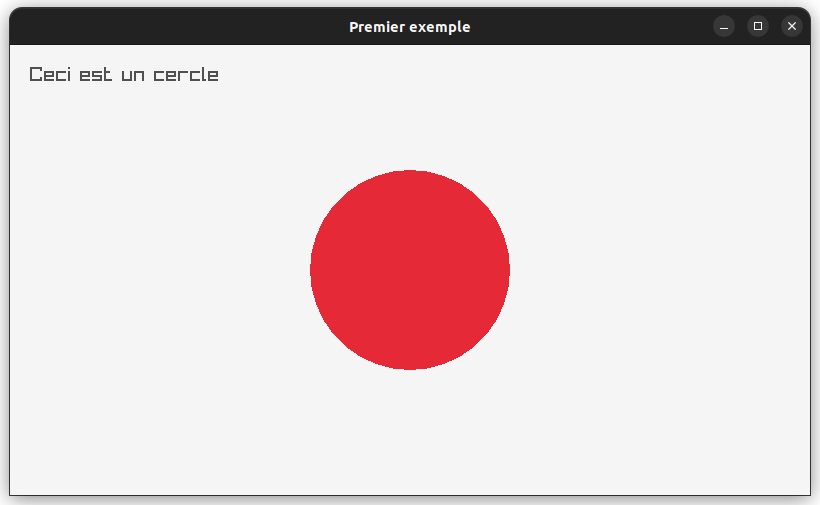
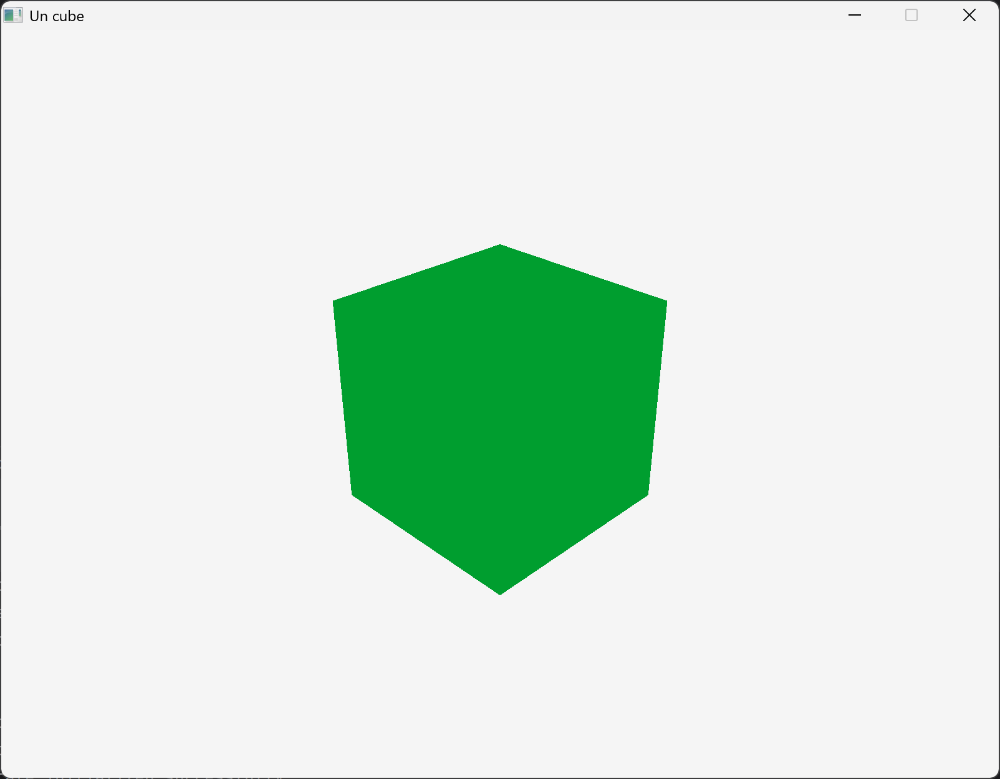
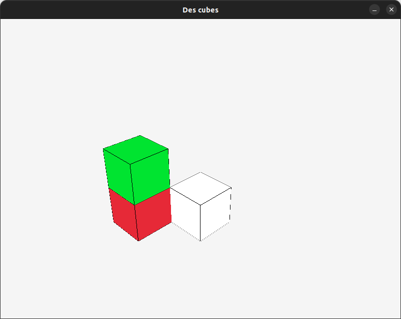
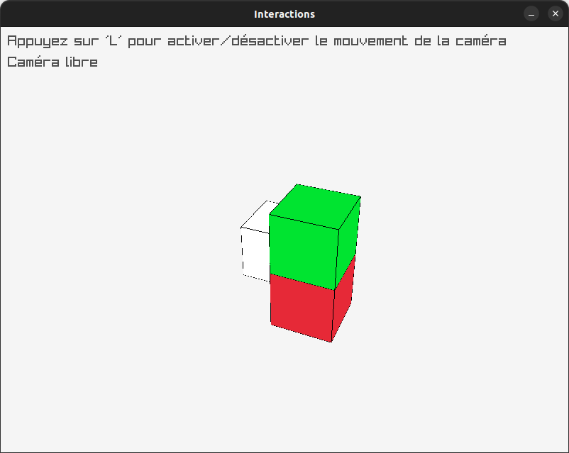
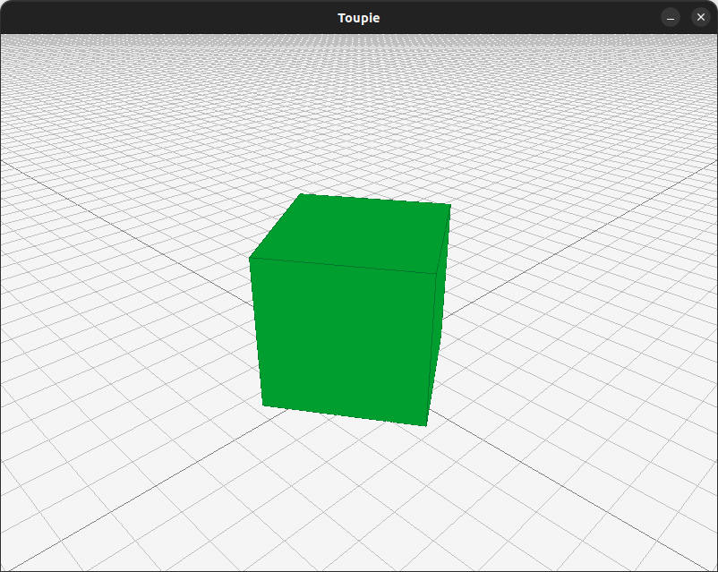
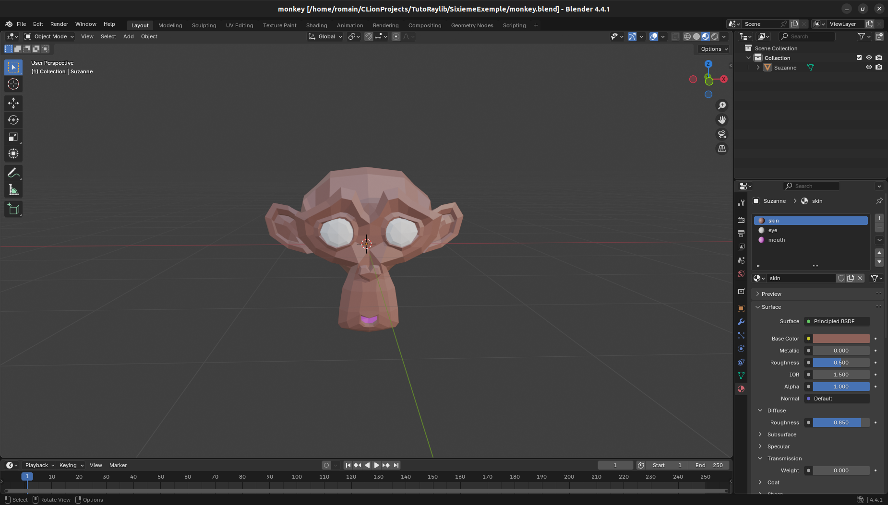
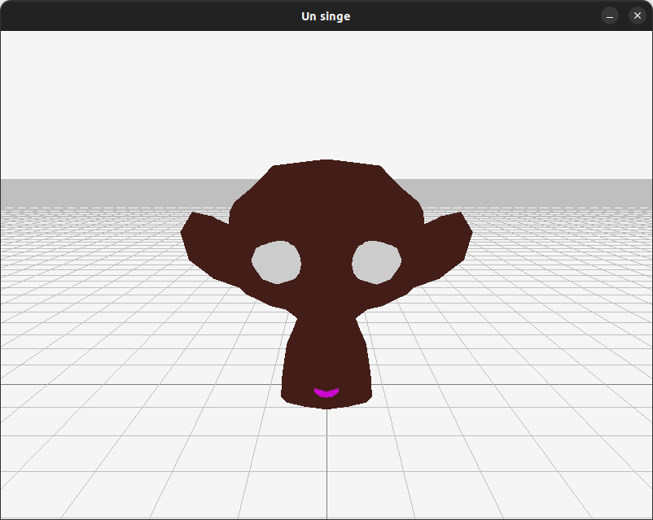
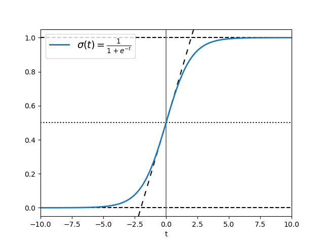
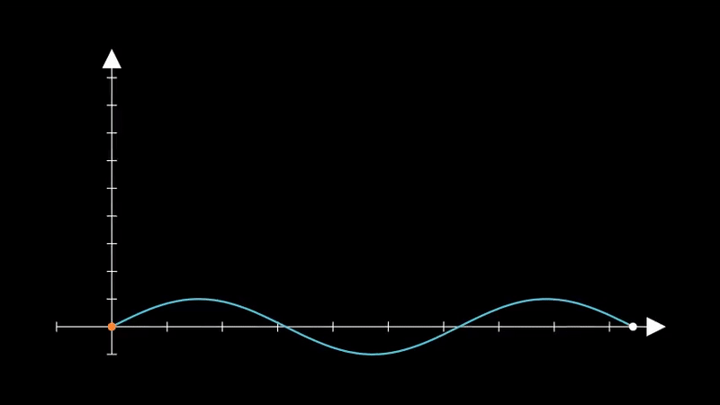

(c) 2025 by Romain Blondel; licensed under [CC BY-NC-SA 4.0](https://creativecommons.org/licenses/by-nc-sa/4.0/). Version 1.0 26.04.02

# Tuto raylib

## Introduction

Dans la vie courante, il est rare d'intéragir avec un programme directement par le terminal. Les interfaces graphiques offrent de nouvelles possibilités d'affichage ainsi qu'une expérience utilisateur plus agréable. Ce document vise à donner un aperçu de [raylib](https://www.raylib.com), une bibliothèque permettant de créer des interfaces graphiques en C++.

> raylib est à l'origine une bibliothèque C, pensée pour programmer des jeux vidéo. Elle a l'avantage d'être relativement simple à utiliser, et d'avoir été portée dans de nombreux langages et sur toutes les plateformes. Son origine en C fait que certains exemples de la documentation doivent être quelque peu adaptés pour être dans un style plus proche du C++.

> Il existe de nombreuses autres bibliothèques permettant de créer des interfaces graphiques, comme [Qt](https://qt.io/), [GLFW](https://www.glfw.org/), [OGRE](https://www.ogre3d.org/), [wxWidgets](https://www.wxwidgets.org/), ou encore [SDL](https://www.libsdl.org/), qui ont chacunes leurs avantages et inconvénients, donc il ne faut surtout pas hésiter à regarder s'il y en a une semblant plus adaptée à un projet particulier.

Le document structuré comme suit :

1. Nous verrons un [exemple simple de création d'une fenêtre](#premier-exemple--prise-en-main), avec un texte et une figure en 2D.
2. Nous modulariserons le code afin de séparer le contenu à afficher et la manière de l'afficher, et présenterons du même coup un [exemple de dessin 3D](#deuxième-exemple--modularisation-et-dessin-3d).
3. On complexifiera un peu l'affichage en [ajoutant plusieurs objets](#troisième-exemple--dessin-de-plusieurs-objets-et-mouvements-de-caméra), ainsi que la possibilité de déplacer la caméra.
4. Le [quatrième exemple](#quatrième-exemple--interactivité-souris-clavier-boutons-) montrera comment rendre l'affichage interactif, avec la souris et le clavier, ainsi que des boutons.
5. Le [cinquième exemple](#cinquième-exemple--évolution-en-temps-réel) montrera comment faire évoluer le dessin en fonction du temps.
6. Finalement, le [dernier exemple](#sixième-exemple--ajout-dobjets-plus-complexes) montrera comment afficher un modèle 3D plus complexe.

### Quelques concepts préalables

Quand on utilise une bibliothèque graphique, il faut bien comprendre son comportement :

- il y a celles qui utilisent une approche de dessin séquentielle : on dessine un objet, puis un autre, et ainsi de suite ;
- et il y a celles évènementielles, dont raylib : l'idée est d'avoir une boucle infinie qui va attendre des évènements ; cela peut être un clic de souris, une touche de clavier ou même un simple délais d'attente ; lorsque qu'un évènement se produit, on le traite, puis on retourne à la boucle infinie d'attente.

Il faut donc programmer _avant_ cette boucle toutes les fonctions qui vont être associées à des évènements, puis initialiser tout ce qu'il faut (fenêtres de dessin, boutons, variables, ...) avant de lancer la boucle principale.

En général, on structure celle-ci de la manière suivante :

1. gestion des évènements ;
2. évolution du système (évènements liés au temps ; on peut donc le voir comme un cas particulier du 1.) ;
3. dessin de la nouvelle image.

Ce sont ces étapes qui seront détaillées dans la suite de ce document.

---

## Installation et compilation

Afin de faciliter l'usage de raylib, nous allons utiliser [CMake](https://cmake.org/) comme outil d'aide à la compilation ; mais l'usage d'un `Makefile` est également possible si raylib est déjà disponible sur le système en ajoutant le flag `-lraylib`. Nous laisserons le soin au lecteur de regarder comment faire l'installation dans ce cas là, si cela l'intéresse ([référence d'installation sur le GitHub de raylib](https://github.com/raysan5/raylib?tab=readme-ov-file#build-and-installation)).

Avec CMake, on pourra directement installer raylib depuis CMake lui-même, ce qui permet de ne pas avoir à s'en soucier sur chaque appareil sur lequel on sera amené à travailler.

Pour commencer, il faut créer un fichier `CMakeLists.txt` à la racine du projet. C'est un simple fichier texte qui contiendra les instructions de construction pour les différents exécutables. On commence par indiquer la version minimale de CMake requise, ainsi que la version de C++ à utiliser. On peut également indiquer le nom du projet et sa version. Finalement, on ajoute les instructions pour définir les dossiers de sortie des exécutables et des bibliothèques afin de les retrouver facilement.

```cmake
# CMakeLists.txt
cmake_minimum_required(VERSION 3.21)
project(NOM_DU_PROJET)
set(CMAKE_CXX_STANDARD 20)
set(PROJECT_WARNING_FLAGS
    -pedantic
    -Wall
    -Wextra
    -Wold-style-cast
    -Woverloaded-virtual
    -Wfloat-equal
    -Wshadow
    -Wwrite-strings
    -Wpointer-arith
    -Wcast-qual
    -Wcast-align
    -Wconversion
)

set(CMAKE_RUNTIME_OUTPUT_DIRECTORY ${CMAKE_BINARY_DIR}/bin)
set(CMAKE_LIBRARY_OUTPUT_DIRECTORY ${CMAKE_BINARY_DIR}/lib)
```

Ensuite, on peut ajouter les instructions pour vérifier si raylib est installé sur le système, et s'il ne l'est pas, de l'installer. Si l'on désire avoir accès à des boutons, on peut également ajouter l'installation de [raygui](https://github.com/raysan5/raygui) (une autre option pour utiliser raygui est de copier le fichier d'en-tête [`raygui.h`](https://github.com/raysan5/raygui/blob/master/src/raygui.h) dans le projet et de le traiter comme un fichier d'en-tête classique).

```cmake
# CMakeLists.txt
# ...
# Inspiré de https://github.com/raysan5/raylib/blob/master/projects/CMake/CMakeLists.txt

include(FetchContent)
set(FETCHCONTENT_QUIET FALSE)

set(RAYLIB_VERSION 5.5)
find_package(raylib ${RAYLIB_VERSION} QUIET) # QUIET or REQUIRED
if (NOT raylib_FOUND) # If there's none, fetch and build raylib
    FetchContent_Declare(
            raylib
            DOWNLOAD_EXTRACT_TIMESTAMP OFF
            URL https://github.com/raysan5/raylib/archive/refs/tags/${RAYLIB_VERSION}.tar.gz
    )
    FetchContent_GetProperties(raylib)
    if (NOT raylib_POPULATED) # Have we downloaded raylib yet?
        FetchContent_MakeAvailable(raylib)
    endif ()
endif ()

# Optionnel : installation de raygui
FetchContent_Declare(
        raygui
        GIT_REPOSITORY "https://github.com/raysan5/raygui.git"
        GIT_TAG "4.0"
        GIT_PROGRESS TRUE
)
FetchContent_MakeAvailable(raygui)
```

---

## Premier exemple : prise en main

Commençons par la construction d'une simple fenêtre avec un texte et une figure en deux dimensions. Nous allons d'abord faire cela dans un seul fichier, puis l'on modularisera par la suite.

Commencer par créer un sous-dossier (p.ex. `PremierExemple`, mais vous pouvez choisir librement ce nom, tant que vous restez cohérent(e) au niveau de votre `CMakeLists.txt`).  
Ajoutez ensuite ce sous-dossier à votre fichier `CMakeLists.txt` principal :

```cmake
add_subdirectory(PremierExemple)
```

Allez ensuite dans le sous-dossier `PremierExemple` et créez votre fichier C++, p.ex. `main_exemple1.cpp` (mais vous pouvez changer librement ce nom).

Il faut tout d'abord inclure les fichiers d'en-tête de raylib, puis écrire la fonction `main()` :

```c++
#include <raylib.h>

int main()
{
    // À compléter
    return 0;
}
```

Pour pouvoir afficher quelque chose, nous commençons par initialiser la fenêtre. On peut le faire en utilisant la [fonction `InitWindow()`](https://www.raylib.com/cheatsheet/cheatsheet.html), qui prend en argument la largeur et la hauteur de la fenêtre, ainsi qu'un titre.  
Et comme toujours en programmation, il faut libérer toute ressource que l'on a utilisé, donc on termine le programme par la fonction `CloseWindow()`.

```c++
#include <raylib.h>

int main()
{
    InitWindow(800, 450, "Premier exemple");

    CloseWindow();
    return 0;
}
```

Il faut ensuite lancer la boucle principale d'attente d'évènements, qui se terminera lorsque l'utilisateur fermera la fenêtre :

```c++
#include <raylib.h>

int main()
{
    InitWindow(800, 450, "Premier exemple");

    while (!WindowShouldClose()) {
        BeginDrawing();

            // Ce que l'on veut afficher

        EndDrawing();
    }

    CloseWindow();
    return 0;
}
```

On peut maintenant ajouter différents éléments à afficher. Par exemple, on peut afficher un texte en utilisant la fonction `DrawText()`, qui prend en argument le texte à afficher, la position du coin supérieur gauche du texte, la taille de la police et la couleur du texte.

Il y a également la possibilité d'afficher des formes géométriques. Par exemple, on peut afficher un cercle via la fonction `DrawCircle()`, qui prend en argument le centre du cercle, son rayon, sa couleur et sa bordure ([on trouvera ici d'autres exemples de formes 2D](https://www.raylib.com/examples/shapes/loader.html?name=shapes_basic_shapes)).

Il est important en règle générale de remettre la couleur de fond de la fenêtre à chaque tour de boucle, pour éviter que les éléments ne se superposent. Celà se fait via la fonction `ClearBackground()`, laquelle prend en argument la couleur desirée.

```c++
#include <raylib.h>

int main()
{
    InitWindow(800, 450, "Premier exemple");

    while (!WindowShouldClose()) {
        BeginDrawing();

        ClearBackground(RAYWHITE);

        DrawText("Ceci est un cercle", 20, 20, 20, DARKGRAY);

        DrawCircle(400, 225, 100, RED);

        EndDrawing();
    }

    CloseWindow();
    return 0;
}
```

Et voilà !

Il nous faut maintenant compiler. Pour cela il faut créer un fichier `CMakeLists.txt` dans le sous-dossier `PremierExemple`.
Ce fichier va gérer tout ce qu'il y a dans ce sous-dossier.
Ici c'est très simple :

- on n'a qu'un seul fichier source ; il suffit simplement de choisir un nom pour notre fichier exécutable, p.ex. `exemple1` (contrairement à ce que l'on fait d'habitude en exercices, il n'est pas nécessaire que cet exécutable ait le même nom que le fichier source qui contient le `main()` ; on est libre de choisir) ;
- et il faut dire que l'on veut utiliser la bibliothèque (« _library_ ») raylib.

Ce qui donne :

```cmake
# CMakeLists.txt du premier exemple

add_executable(exemple1 main_exemple1.cpp)
target_compile_options(exemple1 PRIVATE ${PROJECT_WARNING_FLAGS})
target_link_libraries(exemple1 raylib)
```

Pour compiler tout en gardant propres les (sous-)dossiers des codes sources, on a l'habitude de créer un sous-dossier `build` pour tout le projet : sous le dossier princpal créez le sous-dossier `buid` et allez-y :

```
.
├── build
├── CMakeLists.txt
└── PremierExemple
    ├── CMakeLists.txt
    └── main_exemple1.cpp
```

Depuis ce sous-dossier `build`, lancez les deux commandes suivantes :

```sh
cmake ..
cmake --build .
```

Cela va :

- créer tout ce qui est nécessaire pour compiler ;
- installer raylib si elle n'est pas déjà installée ;
- compiler votre programme, et créer l'exécutable `bin/exemple1`.

La commande `cmake ..` va générer les fichiers de construction pour le projet. Elle est à utiliser après chaque modification du `CMakeLists.txt`.  
La commande `cmake --build .` va compiler le projet et créer les exécutables. On peut compiler un seul exécutable en ajoutant le nom de celui-ci à la fin de la commande ; p.ex. :

    cmake --build . --target nom_de_l_executable
    
L'intérêt d'être dans un dossier `build` est que cela garde propres les sources du projet, en mettant tous les fichiers intermédaires (de construction et les exécutables) dans le dossier `build`.

> Note 1 : parfois, le compilateur peut réutiliser un fichier d'une compilation précédente s'il ne détecte pas de changement dans le code. Cela est dû à des dépendances mal écrites dans les `CMakeLists.txt` et peut parfois faire réapparaître une erreur pourtant réglée auparavant. Dans ce cas, le mieux est de bien comprendre la source de l'erreur, puis corriger le(s) `CMakeLists.txt` impliqués  et relancer la commande :
> 	 cmake .. && cmake --build .

> Note 2 : la plupart des éditeurs de code permettent aussi de définir des configurations pour de faire ces constructions dans un autre dossier, et cela sans devoir passer par le terminal. Référez vous pour cela à la documentation de votre éditeur de code.

Vous pouvez donc maintenant lancer exécutable (`build/bin/exemple1`). Cela devrait ressembler à ceci :



Avant de passer à la suite, mentionnons plusieurs paramètres pouvant être utiles pour la configuration de la fenêtre. Par exemple, il y a un système de `flags` qui permettent de définir son comportement ([exemple des `flags` possibles](https://www.raylib.com/examples/core/loader.html?name=core_window_flags)). On peut par exemple définir si la fenêtre est redimensionnable, si elle est en plein écran, si elle est visible, etc. On peut également lui fixer une taille minimale afin que nos éléments ne soient pas trop écrasés. Il est aussi commun de fixer un nombre de frames par seconde (FPS), pour éviter que le programme ne tourne trop vite.

```c++
// ###########################################################
/*
 * Optionnel, les "flags" permettent de définir le comportement de la fenêtre
 * par exemple le redimensionnement "FLAG_WINDOW_RESIZABLE" ou
 * l'adaptation à la résolution "FLAG_WINDOW_HIGHDPI"
 */
SetConfigFlags(FLAG_WINDOW_RESIZABLE | FLAG_WINDOW_HIGHDPI);
// ###########################################################

// Initialisation de la fenêtre, avec la largeur, la hauteur et le titre
InitWindow(800, 450, "Premier exemple");

// Optionnel, on peut fixer une taille minimale pour la fenêtre
SetWindowMinSize(360, 320);

//  Optionnel, on peut fixer le nombre d'images par seconde
SetTargetFPS(60);
```

Finalement, nous allons voir comment centrer le cercle dans la fenêtre lorsqu'elle est redimensionnable. Pour cela, on peut utiliser les fonctions `GetScreenWidth()` et `GetScreenHeight()` pour obtenir la taille de l'écran, et ainsi calculer la position du cercle :

```c++
#include <raylib.h>


int main()
{
    // Valeurs initiales, modifiables par la suite
    int largeur = 800;
    int hauteur = 450;

    SetConfigFlags(FLAG_WINDOW_RESIZABLE | FLAG_WINDOW_HIGHDPI);
    InitWindow(largeur, hauteur, "Premier exemple");
    SetWindowMinSize(360, 320);

    SetTargetFPS(60);

    // Boucle principale
    while (!WindowShouldClose())
    {
        /*
         * Récupération de la largeur et de la hauteur de la fenêtre
         * en cas de redimensionnement
         */
        largeur = GetScreenWidth();
        hauteur = GetScreenHeight();

        // Début du dessin
        BeginDrawing();

            ClearBackground(RAYWHITE);

            DrawText("Ceci est un cercle", 20, 20, 20, DARKGRAY);

            DrawCircle(largeur / 2, hauteur / 2, 100, RED);

        EndDrawing();
    }

    CloseWindow();
    return 0;
}
```

> Pour découvrir d'autres exemples et trouver de l'inspiration, on pourra consulter la [galerie d'exemples de raylib](https://www.raylib.com/examples.html). Il existe également une page regroupant les [différentes fonctions de raylib](https://www.raylib.com/cheatsheet/cheatsheet.html), mais elle est moins pratique à utiliser.

---

## Deuxième exemple : modularisation et dessin 3D

On va maintenant modulariser notre code. Le but ici est de séparer ce que l'on veut visualiser et le contenu de celui-ci. L'idée est d'organiser le programme selon deux grands principes (dit « [_design patterns_](https://fr.wikipedia.org/wiki/Patron_de_conception) ») :

- clairement séparer trois choses :
  - la gestion de l'application (le `main()` ou le `run()`, cf. plus loin) ;
  - le contenu à afficher ;
  - et la façon de l'afficher (dans les différentes formes : affichage à l'écran, texte, dans un fichier, ...) ;
- avoir une claire distinction entre ce qui doit être affiché, et la manière de le faire sur les différents supports, celle-ci ne devant pas intérferer avec le contenu.

> Dans ce qui suit, nous détaillons la démarche, mais il n'est pas nécessaire de tout comprendre dans le détail pour pouvoir bien réutiliser le code fourni. Néanmoins, une fois les connaissances nécessaires à la compréhension de celui-ci acquise, il peut toujours être intéressant de revenir sur les différents choix de conception.

Nous allons séparer le code sur trois grands axes (libre au lecteur d'adapter cela à ses besoins), dans trois sous-dossiers :

- `general` : qui contient tout le code « général », le coeur du projet, indépendemment de la façon dont il est visualisé ;
- `text` : qui contient la « visualisation » en mode texte, donc simplement l'affichage de messages sur le terminal ;
- `raylib` : qui contient la visualisation graphique en utilisant la bibliothèque raylib.

D'un point de vue abstrait, nous différencierons ce qui est _dessinable_ (les objets que l'on veut voir visualisés) et les _supports à dessin_ (les environnements que l'on utilise pour visualiser : ici en mode texte ou avec la bibliothèque graphique raylib ; mais on pourrait imaginer d'autres modes comme par exemple des représentations numériques (suites de nombres) dans des fichiers binaires, ou d'autres bibliothèques graphiques, etc.).

Créez un nouveau sous-dossier dans votre projet, p.ex. `DeuxiemeExemple`, et créez y les trois sous-dossiers cités ci-dessus. Vous avez alors l'architecture suivante :

```
.
├── build
├── CMakeLists.txt
├── PremierExemple
│   ├── CMakeLists.txt
│   └── main_exemple1.cpp
└── DeuxiemeExemple
    ├── general
    ├── raylib
    └── text
```

Pensez aussi à ajouter ce nouveau dossier à votre `CMakeLists.txt` principal :

```cmake
add_subdirectory(DeuxiemeExemple)
```


### Général

Dans le sous-dossier `general`, nous mettons donc tout ce qui relève de l'aspect général du projet, indépendemment de la visualisation _concrète_. On a donc en particulier ici les deux concepts (abstractions) de « dessinable » et de « support à dessin ».  
Conceptuellement, les « dessinables » sont les plus simples : il suffit d'avoir une méthode permettant de les dessiner sur un support à dessin :

```c++
// dessinable.h
#pragma once

class SupportADessin; // pré-déclaration

class Dessinable {
public:

    // la raison d'être des Dessinable
    virtual void dessine_sur(SupportADessin&) const = 0;

    // mise en virtuel du destructeur (puisque classe abstraite)
    virtual ~Dessinable()                    = default;

    // remise par défaut des constructeurs de copie et de déplacement
    Dessinable(Dessinable const&)            = default;
    Dessinable& operator=(Dessinable const&) = default;
    Dessinable(Dessinable&&)                 = default;
    Dessinable& operator=(Dessinable&&)      = default;

    // et remise aussi par défaut du constructeur par défaut
    Dessinable() = default;
};
```

Un support à dessin fournit quant à lui une méthode pour dessiner les différents contenus (pour l'instant les contenus sont flous, c'est juste pour l'exemple, mais ce sont eux qui seront les objets concrets que l'on veut dessiner) :

```c++
// support_a_dessin.h
#pragma once

// prédéclaration de tous les contenus que l'on veut dessiner
class Contenu;
// ....

class SupportADessin {
public:

    /*
     * La raison d'être des Dessinable
     *
     * Mettre ici toutes les méthodes nécessaires pour dessiner tous les
     * objets que l'on veut dessiner. Par exemple :
     */
    virtual void dessine(Contenu const& a_dessiner) = 0;
    // virtual void dessine(Nounours const& a_dessiner) = 0;
    // virtual void dessine(Voiture  const& a_dessiner) = 0;

    // mise en virtuel du destructeur (puisque classe abstraite)
    virtual ~SupportADessin() = default;

    // on ne copie pas les supports à dessin
    SupportADessin(SupportADessin const&)            = delete;
    SupportADessin& operator=(SupportADessin const&) = delete;

    // mais on peut les déplacer
    SupportADessin(SupportADessin&&)            = default;
    SupportADessin& operator=(SupportADessin&&) = default;

    // on remet aussi la version par défaut du constructeur par défaut
    SupportADessin() = default;
};
```

Maintenant, pour chaque contenu, il suffit de dériver de la classe `Dessinable` et de redéfinir la méthode `dessine_sur()` comme suit :

```c++
// contenu.h
#pragma once

#include "dessinable.h"
#include "support_a_dessin.h"

class Contenu : public Dessinable {
public:
    // à adapter suivant les besoins :
    ~Contenu()                override = default;
    Contenu(Contenu const&)            = default;
    Contenu& operator=(Contenu const&) = default;
    Contenu(Contenu&&)                 = default;
    Contenu& operator=(Contenu&&)      = default;
    Contenu()                          = default;

    /*
     * Ceci est la méthode devant être ajoutée à toute classe
     * étendant Dessinable, afin de pouvoir être dessinée correctement.
     */
    void dessine_sur(SupportADessin& support) const override
    { support.dessine(*this); }

    /*
     * Le reste de la classe peut être quelconque selon les besoins.
     */
};
```

`dessine_sur()` fait alors exactement ce que son nom indique : elle va appeler la méthode `dessine()` du support à dessin, en lui passant le contenu à dessiner, c.-à-d. elle-même.

> Le fait de devoir _copier_ cette définition de `dessine_sur()`, qui est la même pour chaque `Dessinable`, peut paraitre contre intuitif (en effet, pourquoi ne pas juste la mettre dans dessinable ?). Cela est entre autre dû au fait que cette architecture, appelée « [_double dispatch_](https://en.wikipedia.org/wiki/Double_dispatch) », est une généralisation du polymorphisme qui n'est pas totalement prévue en C++.


### Texte

Passons maintenant à l'utilisation de cette nouvelle abstraction pour visualiser notre contenu en mode texte, avec un `main()` ressemblant à cela (à mettre dans le sous-dossier `text`) :

```c++
// main_text.cpp
#include <iostream>
#include "text_viewer.h"
#include "contenu.h"

int main()
{
  TextViewer ecran(std::cout);

  Contenu c;
  c.dessine_sur(ecran);

  return 0;
}
```

Le `TextViewer` est un support à dessin qui va afficher le contenu sur un `ostream` comme p.ex. la sortie standard (`std::cout`).

```c++
// text_viewer.h
#pragma once

#include <iostream>
#include "support_a_dessin.h"

class TextViewer : public SupportADessin {
public:
    explicit TextViewer(std::ostream& flot_) : flot(flot_) {}

    ~TextViewer() override                   = default;
    TextViewer(TextViewer const&)            = delete;
    TextViewer& operator=(TextViewer const&) = delete;
    TextViewer(TextViewer&&)                 = default;
    TextViewer& operator=(TextViewer&&)      = default;

    /*
     * Il faut surcharger la méthode dessine pour dessiner le contenu.
     * Ne pas oublier de le faire pour toutes les méthodes de dessin !
     */
    void dessine(Contenu const& a_dessiner) override;

private:
    std::ostream& flot;
};
```

On peut alors implémenter la méthode `dessine()` pour afficher le contenu sur la sortie standard.

```c++
// text_viewer.cpp
#include <iostream>
#include "text_viewer.h"
#include "contenu.h"

void TextViewer::dessine(Contenu const&)
{
    flot <<
        "+------+.   " << std::endl <<
        "|`.    | `. " << std::endl <<
        "|  `+--+---+" << std::endl <<
        "|   |  |   |" << std::endl <<
        "+---+--+.  |" << std::endl <<
        " `. |    `.|" << std::endl <<
        "   `+------+" << std::endl;
    // Dessin de https://www.asciiart.eu/art-and-design/geometries
}
```

Bien entendu que dans un cas concret, nous utiliserons le contenu en paramètre afin d'afficher quelque chose de pertinent. Ici pour simplifier `Contenu` n'est qu'une coquille vide. Cela changer.

À ce stade, on a donc les fichiers suivants (dans le sous-dossier `DeuxiemeExemple`) :

```
.
├── general
│   ├── contenu.h
│   ├── dessinable.h
│   └── support_a_dessin.h
├── raylib
└── text
    ├── main_text.cpp
    ├── text_viewer.cpp
    └── text_viewer.h
```

Essayons de compiler. Il faut pour cela créer les trois `CMakeLists.txt` :

- dans le sous-dossier `DeuxiemeExemple` lui-même : simplement annoncer les trois sous-dossiers :

```cmake
add_subdirectory(general)
# add_subdirectory(raylib) # on commente pour le moment car on va commencer par le texte
add_subdirectory(text)
```

- dans le sous-dossier `DeuxiemeExemple/general` : on va créer une bibliothèque avec les fichiers `contenu.h`, `dessinable.h` et `support_a_dessin.h`, laquelle pourra être utilisée dans le reste du projet :

```cmake
# general/CMakeLists.txt

add_library(Dessin contenu.h dessinable.h support_a_dessin.h)
set_target_properties(Dessin PROPERTIES LINKER_LANGUAGE CXX)
target_include_directories(Dessin PUBLIC ${PROJECT_SOURCE_DIR}/DeuxiemeExemple/general)
```

> Quand il n'y a que des fichiers `.h`, il faut spécifier que ce sont des fichiers d'en-tête C++ grace à la propriété `LINKER_LANGUAGE CXX`, sinon on obtient une erreur (confusion avec le C). De plus, pour que d'autres fichiers puissent utiliser cette bibliothèque, il faut ajouter le dossier contenant les fichiers d'en-tête avec `target_include_directories`.

- dans le sous-dossier `DeuxiemeExemple/text` :

```cmake
# text/CMakeLists.txt

add_library(TextViewer text_viewer.h text_viewer.cpp)
target_compile_options(TextViewer PRIVATE ${PROJECT_WARNING_FLAGS})
target_link_libraries(TextViewer Dessin)

add_executable(exemple2_text main_text.cpp)
target_compile_options(exemple2_text PRIVATE ${PROJECT_WARNING_FLAGS})
target_link_libraries(exemple2_text TextViewer)
```

On a donc les fichiers suivants :

```
├── CMakeLists.txt
├── general
│   ├── CMakeLists.txt
│   ├── contenu.h
│   ├── dessinable.h
│   └── support_a_dessin.h
├── raylib
└── text
    ├── CMakeLists.txt
    ├── main_text.cpp
    ├── text_viewer.cpp
    └── text_viewer.h
```

On peut alors retourner dans le sous-dossier `build` (tout en haut) et refaire :

```sh
cmake ..
cmake --build .
```

Ce qui compile les bibliothèques que nous voulons créer, puis l'exécutable `build/bin/exemple2_text`.
Si on le lance, on a bien dans le terminal :

```
+------+.
|`.    | `.
|  `+--+---+
|   |  |   |
+---+--+.  |
 `. |    `.|
   `+------+
```

### raylib

Pour l'affichage graphique, nous procéderons un peu différemment : notre `main()` ressemblera à ceci :

```c++
// main_raylib.cpp
#include "raylib_render.h"

int main()
{
    raylibRender ecran;
    ecran.run();
    return 0;
}
```

où `raylibRender` est un `SupportADessin` dont la méthode `run()` appelle la méthode `dessine_sur()` ; et le « contenu » sera un attribut de cette classe `raylibRender` :

```c++
// raylib_render.h
#pragma once

#include "support_a_dessin.h"
#include "contenu.h"
#include <raylib.h>

class raylibRender : public SupportADessin {
public:
    raylibRender();
    ~raylibRender() override;

    void run();

    void dessine(Contenu const& a_dessiner) override;
private:
    Camera3D camera;

    Contenu c;
};
```

> Notons que le contenu pourrait être remplacé par un pointeur vers un contenu pour éviter des copies. Dans un projet plus large, ce point devra certainement être pris en considération.  
> Notez aussi la présence d'une `Camera3D`, qui est le moyen de raylib de faire des dessins en 3D. Nous reviendrons sur ce point précis dans notre prochain exemple.

Nous allons maintenant préparer les constructeurs et destructeurs afin que nous n'ayons à nous soucier uniquement de l'affichage dans la méthode `run()`.

```c++
// raylib_render.cpp

#include "raylib_render.h"

raylibRender::raylibRender()
{
    // parmétres de la fenêtre
    SetConfigFlags(FLAG_WINDOW_HIGHDPI);
    InitWindow(800, 600, "Un cube");

    // paramétres de la caméra
    camera.position = { 5.0f, 5.0f, 5.0f };
    camera.target   = { 0.0f, 1.0f, 0.0f };
    camera.up = camera.target;
    camera.fovy = 45.0f;
    camera.projection = CAMERA_PERSPECTIVE;

    SetTargetFPS(60);
}

raylibRender::~raylibRender()
{
    CloseWindow();
}
```

On notera donc que l'initialisation et la fermeture de la fenêtre sont identiques à ce que nous avions fait dans le premier exemple ; mais on rajoute ici l'initialisation des paramètres de caméra : sa position, le point qu'elle vise (`target`), le vecteur représentant la direction « haut » pour elle (`up`), son champ de vision (`fovy`) et le type de projection.

> Il est aussi possible de faire [une caméra dans le cas 2D](https://www.raylib.com/examples/core/loader.html?name=core_2d_camera), mais cela ne sera pas abordé ici.

On peut maintenant écrire la méthode `run()` afin d'avoir un affichage fonctionnel :

```c++
void raylibRender::run()
{
    while (!WindowShouldClose()) {
        BeginDrawing();
            ClearBackground(RAYWHITE);
            BeginMode3D(camera);
                // Afin de bien voir le cube, on va dessiner une grille.
                DrawGrid(200, 0.5f);

                // Et on dessine le contenu.
                c.dessine_sur(*this);
            EndMode3D();
        EndDrawing();
    }
}
```

Comme dans le premier exemple, on a notre boucle d'exécution où l'on remet un fond blanc avant de dessiner. Néanmoins, afin de dessiner nos objets, nous devons maintenant entrer dans un mode 3D avec la caméra en argument. Il ne manque plus qu'à savoir dessiner le contenu, et cela se fait par la méthode `dessine()`.

```c++
void raylibRender::dessine(Contenu const& a_dessiner)
{
    constexpr Vector3 position({ 0.0f, 1.0f, 0.0f });
    DrawCube(position, 2.0f, 2.0f, 2.0f, LIME);
    DrawCubeWires(position, 2.0f, 2.0f, 2.0f, DARKGREEN);
}
```

Comme pour le mode texte, nous avons simplifié dans cet exemple et dessiné directement un cube. Mais, bien sûr, dans un projet plus complexe ce dessin dépendra des attributs du contenu.

Le dessin d'un cube se fait en appelant la fonction `DrawCube()` avec en argument la position de celui-ci, sa largeur, sa hauteur, sa profondeur et sa couleur ([on trouvera ici d'autres exemples de figures 3D](https://www.raylib.com/examples/models/loader.html?name=models_geometric_shapes)).

> Notons que les fonctions de raylib, ayant à la base été faite en C, ne prennent pas en paramètre des `vector` de C++, mais des `Vector2` / `Vector3` de raylib, selon le nombre de composantes. Similairement, les arguments sont prévus en `float` et non en `double`, et certaines erreurs peuvent venir de là et sont donc réglables en forçant la conversion en `float`, p.ex. en ajoutant un `f` comme suffixe aux valeurs littérales.

Pour compiler nous devons :

1. supprimer le commentaire dans le `CMakeLists.txt` du sous-dossier `DeuxiemeExemple` :

```cmake
add_subdirectory(general)
add_subdirectory(raylib)
add_subdirectory(text)
```

2. créer le `CMakeLists.txt` du sous-dossier `raylib` :

```cmake
# raylib/CMakeLists.txt

add_library(RayRender raylib_render.h raylib_render.cpp)
target_compile_options(RayRender PRIVATE ${PROJECT_WARNING_FLAGS})
target_link_libraries(RayRender raylib Dessin)

add_executable(exemple2_raylib main_raylib.cpp)
target_compile_options(exemple2_raylib PRIVATE ${PROJECT_WARNING_FLAGS})
target_link_libraries(exemple2_raylib RayRender)
```

Après compilation, on devrait obtenir un affichage 3D qui ressemble à ceci :


Dans les codes ci-dessus, nous utilisons également les fonctions `DrawCubeWires()` et `DrawGrid()`, qui permettent respectivement de dessiner les contours du cube et une grille au sol afin de mettre en évidence les objets, mais ceci est superflus en soi :



> Les objets peuvent paraitre très plat, car il n'y a pas de système de lumière par défaut, ni de méthode suffisamment simple pour le présenter ici, ce qui fait qu'il n'y a pas d'ombres par exemple (l'[exemple le plus simple](https://www.raylib.com/examples/shaders/loader.html?name=shaders_basic_lighting) gère l'ombre pour chaque objet, et sinon il faudrait faire un système de « [_shadow mapping_](https://en.wikipedia.org/wiki/Shadow_mapping) »).


---

## Troisième exemple : dessin de plusieurs objets et mouvements de caméra

> Pour les exemples qui suivent, nous nous concentrerons que sur la partie raylib, et nous ne modifierons pas les fichiers `main_raylib.cpp`, `dessinable.h` et `support_a_dessin.h`. Vous pouvez donc simplement copier ces fichiers dans le nouveau sous-répertoire pour votre troisième exemple ; voire même copier toute la structure, p.ex. sous Unix :
> ```sh
> mkdir TroisiemeExemple
> cp -r DeuxiemeExemple/CMakeLists.txt DeuxiemeExemple/general DeuxiemeExemple/raylib TroisiemeExemple
> ```
> Il suffira alors simplement d'éditer les fichiers à modifier.
>
> Par ailleurs, on pourrait aussi, bien sûr, adapter la partie « texte » de façon similaire aux adaptations que nous allons ici apporter à la partie raylib. Mais ce n'est pas l'objet du présent tutoriel.

### Plusieurs vrais objets

Afin d'avoir un peu d'intérêt à l'exemple, nous allons créer des contenus un peu plus pertients. Modifions `general/contenu.h` comme suit :

```c++
// ... (en-têtes)

enum Couleur {
    NONE,
    ROUGE,
    VERT,
    BLEU
};

struct Position {
    double x;
    double y;
    double z;
};

class Contenu : public Dessinable {
public:
    // ... (comme avant)
    // mais SUPPRIMER le cteur par défaut:   Contenu() = default;
    // Le remplacer par :

    Contenu(const Position &p = {0, 0, 0}, const Couleur c = NONE)
    : position(p), color(c) {}

    // ... (comme avant)

    Position get_position() const { return position; }
    Couleur get_color() const { return color; }

private:
    Position position;
    Couleur  color;
};
```

Ceci ajoute donc une `position` et une couleur aux contenus. Nous pouvons aussi modifier la déclaration de `raylibRender` (dans `raylib/raylib_render.h`) afin d'avoir plusieurs contenus à afficher :

```c++
// ... (en-têtes)
#include <vector>

class raylibRender : public SupportADessin {
    // ... (comme avant)

private:
    // ... (Camera3D comme avant)
    // Remplacer : Contenu c;
    // Par :
    std::vector<Contenu> liste_contenus;
};
```

et son initialisation par défaut dans `raylib/raylib_render.cpp` :

```c++
// ... (en-têtes)

raylibRender::raylibRender()
: liste_contenus({
      Contenu(),
      Contenu({-1,1,1}, VERT),
      Contenu({-1,0,1}, ROUGE)
  })
{
    // ... (comme avant)
}
```

Bien sûr, il faut modifier La méthode `dessine()` pour utiliser les propriétés de `Contenu` :

```c++
void raylibRender::dessine(Contenu const& a_dessiner)
{
    const auto [x, y, z] = a_dessiner.get_position();
    const Vector3 position = { static_cast<float>(x), static_cast<float>(y), static_cast<float>(z) };
    auto color = WHITE;
    switch (a_dessiner.get_color()) {
        case ROUGE:
            color = RED;
            break;
        case VERT:
            color = GREEN;
            break;
        case BLEU:
            color = BLUE;
            break;
        default:
            color = WHITE;
            break;
    }
    DrawCube(position, 1.0f, 1.0f, 1.0f, color);
    DrawCubeWires(position, 1.0f, 1.0f, 1.0f, BLACK);
}
```

Note : les `Contenu::position` étant en `double`, mais les posistions dans la raylib en `float`, on doit forcer la conversion via les `static_cast<float>(...)`. (On aurait évidemment pu mettre des `float` dès le départ, mais, restant fidèle à l'indépendance entre coeur de la simulation (`Contenu`) et représentation (raylib), un choix local de la bibliothèque de visualisation **ne** doit **pas** affecter la conception générale du coeur du modèle !)

Finalement, on doit aussi adapter la méthode `run()` pour faire une boucle sur la liste des contenus :

```c++
void raylibRender::run() {
   // ...
   // Remplacer :   c.dessine_sur(*this);
   // par :
   for (auto const& contenu : liste_contenus) {
       contenu.dessine_sur(*this);
   }
}
```

On peut essayer compiler et voir l'effet de nos modifications :

- ajoutez le nouveau dossier au `CMakeLists.txt` principal : `add_subdirectory(TroisiemeExemple)` ;
- supprimez la ligne `add_subdirectory(text)` de `TroisiemeExemple/CMakeLists.txt` ;
- remplacez trois fois `Dessin` par `Dessin3` dans chacune des lignes de `TroisiemeExemple/general/CMakeLists.txt` ;
- remplacez `DeuxiemeExemple` par `TroisiemeExemple` dans la dernière ligne de `TroisiemeExemple/general/CMakeLists.txt` ;
- dans `TroisiemeExemple/raylib/CMakeLists.txt` :
  - remplacez quatre fois `RayRender` par `RayRender3` ;
  - remplacez une fois `Dessin` par `Dessin3` ;
  - remplacez trois fois `exemple2_raylib` par `exemple3` :
  
```cmake
add_library(RayRender3 raylib_render.h raylib_render.cpp)
target_compile_options(RayRender3 PRIVATE ${PROJECT_WARNING_FLAGS})
target_link_libraries(RayRender3 raylib Dessin3)

add_executable(exemple3 main_raylib.cpp)
target_compile_options(exemple3 PRIVATE ${PROJECT_WARNING_FLAGS})
target_link_libraries(exemple3 RayRender3)
```

Vous pouvez ensuite aller dans `build` et faire

```sh
cmake ..
cmake --build .
```

puis lancer `bin/exemple3`. Vous devriez y voir trois cube (rouge, vert et blanc) au lieu d'un seul (illustré ici sans la grille) :



### Mouvements de caméra

Si l'on veut permettre le movement de la caméra, il suffit d'ajouter la fonction `UpdateCamera()` de raylib :

```c++
void raylibRender::run() {
    while (!WindowShouldClose()) {
        UpdateCamera(&camera, CAMERA_FREE);
        // ... (suite comme avant)
}
```

`UpdateCamera()` prend en paramètre la caméra à mettre à jour et le type de mouvement, ici [`CAMERA_FREE`](https://www.raylib.com/examples/core/loader.html?name=core_3d_camera_free), qui gére le mouvement via la souris et les touches `W`, `A`, `S` et `D` (d'autres modes de mouvement sont présentés [ici](https://www.raylib.com/examples/core/loader.html?name=core_3d_camera_first_person)).

Recompilez et essayez les déplacements. Attention la caméra est sensible à la souris et il se peut donc qu'en ayant amené la souris sur la fenêtre vous ayez déplacé le point de vue ; bougez alors la souris pour voir les cubes.

---

## Quatrième exemple : interactivité (souris, clavier, boutons, ...)

Dans ce quatrième exemple, nous allons voir trois interactions possibles :

- le clavier : utiliser une touche pour activer ou non le déplacement de la caméra ;
- la souris : récupérer sa position et l'utiliser pour y dessiner un objet ;
- raygui : utiliser un bouton pour activer une fonctionalité.

> Comme pour le troisième exemple, vous pouvez ici repartir de celui-ci, puis éditer les fichiers modifiés ; p.ex. sous Unix :
> ```sh
> mkdir QuatriemeExemple
> cp -r TroisiemeExemple/CMakeLists.txt TroisiemeExemple/general TroisiemeExemple/raylib QuatriemeExemple
> ```

Commençons par ajouter deux attributs à la classe `raylibRender` pour gérer l'état (actif ou non) du mouvement de la caméra et du dessin du pointeur de souris :

```c++
// ...
class raylibRender : public SupportADessin {
// ...
private:
    // ...
    bool deplacement;
    bool pointeur;
};
```

que l'on initialise par défaut dans `raylib/raylib_render.cpp` :

```c++
// ... (en-têtes)

raylibRender::raylibRender()
: liste_contenus({
      Contenu(),
      Contenu({-1,1,1}, VERT),
      Contenu({-1,0,1}, ROUGE)
  })
  , deplacement(false)
  , pointeur(false)
{
    // ... (comme avant)
}
```

Décidons d'activer le déplacement avec la touche `L`. Pour cela, on vérifie dans la boucle principale si la touche `L` est pressée, et si oui, on change l'état du déplacement. Puis on met à jour la caméra seulement si le déplacement est activé :

```c++
void raylibRender::run() {
    while (!WindowShouldClose()) {
        if (IsKeyPressed(KEY_L)) {
            deplacement = !deplacement;
        }
        if (deplacement) {
            UpdateCamera(&camera, CAMERA_FREE);
        }
        // ...
    }
}
```

Ajoutons également un message à l'écran pour indiquer si le déplacement est activé ou non.  
Pour que le texte soit correctement visible, on ne le dessine pas dans le mode 3D, mais _après_ avoir quitté ce mode 3D.  
Pour le [paramétrage du texte](https://www.raylib.com/examples/text/loader.html?name=text_format_text), on donne la chaîne de caractères à afficher, la position du texte (les deux premiers arguments numériques), la taille de la police et la couleur du texte.   
En cas d'utilisation d'une `string` C++, il faut la convertir en « chaîne à la C » via la méthode `c_str()`.

Cela donne le code suivant :

```c++
void raylibRender::run() {
            // ...
            EndMode3D();

            DrawText("Appuyez sur 'L' pour activer/désactiver le mouvement de la caméra", 10, 10, 20, DARKGRAY);
            DrawText((std::string("Caméra ") + (deplacement ? "libre" : "fixe")).c_str(), 10, 40, 20, DARKGRAY);
        EndDrawing();
    }
}
```

Et il ne faut pas oublier d'ajouter `#include <string>` dans l'entête.

> Le code ci-dessus utilise l'opérateur ternaire `?:` que vous ne connaissez peut être pas encore. Cet opérateur utilise trois argument (`A`, `B` et `C`) : `A ? B : C` et il :
> 1. évalue `A` ;
> 2. évalue `B` si `A` est vrai, et sinon évalue `C` ;
> 3. vaut le résultat de la dernière évaluation (`B` ou `C`).
> Dans le cas ci-dessus, `(deplacement ? "libre" : "fixe")` vaut donc `"libre"` si `deplacement` est vrai et `"fixe"` sinon.

On peut essayer compiler et voir l'effet de nos modifications :

- ajoutez le nouveau dossier au `CMakeLists.txt` principal : `add_subdirectory(QuatriemeExemple)` ;
- remplacez trois fois `Dessin3` par `Dessin4` dans chacune des lignes de `QuatriemeExemple/general/CMakeLists.txt` ;
- remplacez `TroisiemeExemple` par `QuatriemeExemple` dans la dernière ligne de `QuatriemeExemple/general/CMakeLists.txt` ;
- dans `QuatriemeExemple/raylib/CMakeLists.txt` : remplacez simplement `3` par `4` ; cela :
  - remplace trois fois `RayRender3` par `RayRender4` ;
  - remplace une fois `Dessin3` par `Dessin4` ;
  - remplace deux fois `exemple3` par `exemple4`.


En lançant `bin/exemple4`, vous devriez alors obtenir :

| Mouvement OFF                                      | Mouvement ON                                           |
|----------------------------------------------------|--------------------------------------------------------|
|  |  |


Voyons maintenant comment ajouter un bouton. Pour cela, nous allons utiliser la bibliothèque raygui, que l'on importe comme suit :

```c++
// raylib_render.cpp

#include "raylib_render.h"
#include <string>
#define RAYGUI_IMPLEMENTATION
#include <raygui.h>
#undef RAYGUI_IMPLEMENTATION

raylibRender::raylibRender()
// ...
```

> Dû à sa conception, il est nécessaire de mettre `#define RAYGUI_IMPLEMENTATION` avant d'inclure le fichier d'en-tête.

Sur le GitHub de [raygui](https://github.com/raysan5/raygui), nous pouvons trouver [les différents composants disponibles](https://github.com/raysan5/raygui?tab=readme-ov-file#basic-controls), ainsi que divers programmes pouvant être utile pour réfléchir à l'interface graphique, comme un [éditeur de layout](https://raylibtech.itch.io/rguilayout) ou [d'icones](https://raylibtech.itch.io/rguiicons), et des exemples d'utilisation.

Pour ce que nous allons faire, le plus adapté est un bouton ON/OFF (« _toggle_ »), que l'on peut créer comme suit :

```c++
void raylibRender::run() {
    while (!WindowShouldClose()) {
        // ...
        BeginDrawing();
            // ...
            GuiToggle(Rectangle(10, 560, 60, 30), "Pointeur", &pointeur);
        EndDrawing();
    }
}
```

Ce bouton prend en argument un rectangle (la position et la taille du bouton), le texte à afficher et un pointeur vers une variable booléenne qui va changer d'état lorsque l'on clique sur le bouton.

> Pour un bouton classique, l'utilisation est un peu différente :
> ```c++
> while (!WindowShouldClose()) {
>       // ...
>       BeginDrawing();
>           // ...
>           if (GuiButton((Rectangle){ X, Y, Longueur, Largeur }, "Texte")) {
>               // Action à réaliser
>           }
>       EndDrawing();
>   }
> ```
> Donc il ne faut pas hésiter à chercher comment s'utilise un composant avant de l'utiliser.

Pour récupérer la position de la souris, on peut utiliser la fonction `GetMousePosition()`, qui renvoie un `Vector2` avec les coordonnées de la souris. On peut alors dessiner p.ex. un cercle à cette position :

```c++
void raylibRender::run() {
    while (!WindowShouldClose()) {
        // ...
        BeginDrawing();
            // ...
            GuiToggle(Rectangle(10, 560, 60, 30), "Pointeur", &pointeur);
            if (pointeur) {
                auto [x, y] = GetMousePosition();
                DrawCircle(static_cast<int>(x), static_cast<int>(y), 10.0f, RED);
            }
        EndDrawing();
    }
}
```


Pour compiler, comme raygui est un fichier d'en-tête, il faut inclure son dossier dans les endroits où chercher. On utilise pour cela la commande `target_include_directories`. Par contre, il **ne** faut par ailleurs **pas** utiliser ici les options de compilation `${PROJECT_WARNING_FLAGS}` qui génèreront bien trop de warnings en raison du C de raygui :

```cmake
# QuatriemeExemple/raylib/CMakeLists.txt

add_library(RayRender4 raylib_render.h raylib_render.cpp)
target_include_directories(RayRender4 PRIVATE ${raygui_SOURCE_DIR}/src)
target_link_libraries(RayRender4 raylib Dessin4)

add_executable(exemple4 main_raylib.cpp)
target_compile_options(exemple4 PRIVATE ${PROJECT_WARNING_FLAGS})
target_link_libraries(exemple4 RayRender4)
```

Compilez, en ignorant les « _warnings_ » propres à `raygui.h` (petite différence de norme entre C et C++).

> Vous pouvez aussi supprimer ces warnings en demandant au compilateur de les ignorer en ajoutant l'option `-Wno-enum-compare` :
> ```cmake 
> target_compile_options(RayRender4 PRIVATE ${PROJECT_WARNING_FLAGS} -Wno-enum-compare)
> ``` 


L'exécutable devrait alors donner un affichage comme suit :

| Pointeur OFF                                     | Pointeur ON                                       |
|--------------------------------------------------|---------------------------------------------------|
|  |  |

> Il est aussi possible de faire [un bouton sans utiliser raygui](https://www.raylib.com/examples/textures/loader.html?name=textures_sprite_button), mais cela est sensiblement plus complexe.

---

## Cinquième exemple : évolution en temps réel

### Un peu de théorie

Le terme « _temps réel_ » représente le fait que le temps (physique) qui s'écoule a une signification dans le programme. Jusqu'ici dans vos programmes, l'utilisateur pouvait attendre 1 seconde ou 10 minutes à l'invite d'un `cin` sans que cela ne change en rien le comportement du programme. Dans un processus « temps réel », le programme continue par contre d'effectuer des actions représentant l'écoulement du temps physique, que l'utilisateur agisse ou non. Ceci permet par exemple d'animer de façon réaliste les éléments du monde que l'on représente.

Considérons le cas d'une balle qu'on lâche depuis une certaine hauteur. On pourrait, comme dans l'exercice que vous avez fait au premier semestre, calculer à l'avance le temps au bout duquel la balle touchera le sol. Mais dans une simulation physique en temps réel, on voudrait avoir la position de la balle à chaque instant, par exemple pour pouvoir l'afficher.

On doit donc pouvoir être capable de décrire à chaque instant la nouvelle position de la balle en fonction de la position précédente et du temps écoulé entre deux calculs. Ce temps est simplement le temps que l'ordinateur a mis pour calculer et afficher la dernière position.

Dans une simulation numérique non temps réel, cet intervalle de temps $dt$ est fixé à une valeur arbitraire, aussi petite que la précision de calcul voulue le nécessite (voir cours d'analyse numérique).

Dans un programme « temps réel », c'est par contre la puissance de la machine qui détermine la valeur de $dt$ : plus la scène est complexe à animer et afficher, plus $dt$ sera grand, et plus la simulation sera approximative et l'animation saccadée.

> NOTE : La raison pour laquelle on ne fixe pas à l'avance l'intervalle $dt$ est qu'on a _a priori_ aucune idée du temps que prendra le calcul (et l'affichage !) d'une image et, surtout, qu'on n'a aucune garantie que ce temps restera constant : plus il y a d'éléments à prendre en compte, plus ce temps augmentera. On s'en rend bien compte dans certains jeux vidéos : lorsqu'il y a un phénomène complexe (p.ex. une explosion) ou trop d'unités à gérer, c'est le nombre d'images par seconde qui diminue et non le temps qui se dilate.

Concrètement, $dt$ est donné par l'écart entre l'image précédente et l'image actuelle, et il est calculé à chaque itération de la boucle principale du programme.

La simulation est donc une boucle qui répète en permanence plusieurs étapes, parmi lesquelles :

1. calcul (ou mise à jour) : on détermine l'état suivant du système, à partir de l'état courant et du pas de temps $dt$ ; c'est dans cette phase que dans votre projet interviendront les équations de la simulation ;
2. affichage à l'écran (ou sur tout autre support à dessin) : on envoie les données vers la carte vidéo (ou sur `cin` ou dans un fichier, etc.) ;
3. gestion des interactions (clavier, souris).

En théorie, aucun calcul concernant la simulation n'est à effectuer dans ces deux dernières phases.

Enfin, lorsqu'une certaine condition d'arrêt est atteinte (p.ex. un certain délai dépassé, une précision suffisante ou un évènement particulier [p.ex. clavier]), on arrête simplement le programme.

### L'exemple

Pour cet exemple, nous repartons des fichiers de [l'exemple 2](#deuxième-exemple--modularisation-et-dessin-3d), et nous modifions le Contenu afin qu'il ait un angle de rotation, ainsi qu'une méthode faisant évoluer cet angle pendant `dt`.

> Vous pouvez donc, comme pour le troisième exemple, repartir du deuxième exemple, puis éditer les fichiers modifiés ; p.ex. sous Unix :
> ```sh
> mkdir CinquiemeExemple
> cp -r DeuxiemeExemple/CMakeLists.txt DeuxiemeExemple/general DeuxiemeExemple/raylib CinquiemeExemple
> ```
> puis éditez les `CMakeLists.txt` comme d'habitude.


Dans `general/contenu.h` :

```c++
class Contenu : public Dessinable {
public:
    // ...
    Contenu(double a = 0.0) : angle(a) {}

    // ...

    double get_angle() const { return angle; }

    void evolue(double dt) { angle += 10.0 * dt; }
private:
    double angle;
};
```

On modifie ensuite la méthode `run()` de `raylibRender` pour faire évoluer le contenu à chaque itération de la boucle principale :

```c++
void raylibRender::run() {
    while (!WindowShouldClose()) {
        const auto dt = GetFrameTime();
        c.evolue(dt);

        BeginDrawing();
        // ...
}
```

Le seul changement par rapport au deuxième exemple est que l'on récupère le temps écoulé depuis la dernière image avec `GetFrameTime()`, et que l'on fait évoluer le contenu en appelant la méthode `evolue()` avec ce temps.

Par ailleurs, il faut aussi modifier la méthode `dessine()` pour prendre en compte l'angle de rotation. On va pour cela utiliser la bibliothèque `rlgl` de raylib, qui permet de faire des transformations sur les objets 3D par des matrices (voir [ce document](https://www.opengl-tutorial.org/beginners-tutorials/tutorial-3-matrices/) d'OpenGl sur le sujet ; OpenGL est la bibliothèque sur laquelle est construite raylib).

```c++
// ...
#include <rlgl.h>
// ...
void raylibRender::dessine(Contenu const& a_dessiner) {
    constexpr Vector3 position({ 0.0f, 1.0f, 0.0f });

    rlPushMatrix();
    rlRotatef(static_cast<float>(a_dessiner.get_angle()), 0.0f, 1.0f, 0.0f);
    DrawCube(position, 2.0f, 2.0f, 2.0f, LIME);
    DrawCubeWires(position, 2.0f, 2.0f, 2.0f, DARKGREEN);
    rlPopMatrix();
}
```

> Si l'on désirait seulement mettre à jour la _position_ du cube, il suffirait simplement de changer son vecteur de position sans se soucier de ces transformations (rotation ici).

Décortiquons ce qui se passe. La fonction `rlPushMatrix()` commence les transformations qui seront appliquées jusqu'à l'appel de `rlPopMatrix()`. On applique ensuite celles que l'on veut effectuer, ici une rotation autour de l'axe Y, avec `rlRotatef()`, qui prend en paramètre l'angle de rotation (en degrés) et les coordonnées de l'axe de rotation (on trouvera [ici](https://www.raylib.com/examples/models/loader.html?name=models_rlgl_solar_system) un exemple plus complexe, ainsi que d'autres possibilités offertes par `rlgl`).

Après compilation, on devrait alors avoir un cube qui tourne :


---

## Sixième exemple : ajout d'objets plus complexes

Comme pour l'exemple précédent, nous allons repartir de l'exemple 2. Le but de cet exemple est de montrer comment ajouter un modèle 3D plus complexe, que ce soit fait via un logiciel de modélisation 3D ou en utilisant un modèle déjà existant.

> Dans notre cas, nous avons juste utilisé un modèle par défaut de [Blender](https://www.blender.org/) que l'on a texturé (il existe de nombreuses ressources en ligne pour apprendre ce logiciel si la curiosité vous y pousse, tel que ce [tutoriel](https://www.youtube.com/watch?v=B0J27sf9N1Y&list=PLjEaoINr3zgEPv5y--4MKpciLaoQYZB1Z)).
> 

Pour commencer, nous allons ajouter à notre classe `raylibRender` un attribut pour le modèle 3D que nous allons charger :

```c++
// ...
class raylibRender : public SupportADessin {
    // ...
private:
    // ...
    Model myModel;
};
```

Puis pour pouvoir utiliser ce modèle, nous devons le charger dans le constructeur de `raylibRender` (et l'enlever dans le destructeur) :

```c++
raylibRender::raylibRender() {
    // ...
    myModel = LoadModel(TextFormat("%sresources/monkey.glb", GetApplicationDirectory()));
    SetTargetFPS(60);
}

raylibRender::~raylibRender() {
    UnloadModel(myModel);
    CloseWindow();
}
```

> Pour voir le modèle de face au lieu de coté, vous pouvez changer la position de départ de la caméra :
> ```c++
>      camera.position = { 0.0f, 2.0f, 5.0f };
> ```
> au lieu de
> ```c++
>      camera.position = { 5.0f, 5.0f, 5.0f };
> ```
>
> Si vous souhaitez tourner le modèle lui-même, utiliser :
> ```c++
>  myModel.transform = MatrixRotateXYZ({DEG2RAD * AngleX, DEG2RAD * AngleY, DEG2RAD * AngleZ});
> ```
> (avec `Angle?` les angles que vous voulez, en degrés).

Le fichier `monkey.glb` est à télécharger [ici](SixiemeExemple/monkey.glb) et à mettre dans le sous-dossier `SixiemeExemple` :

```
SixiemeExemple/
├── CMakeLists.txt
├── general
│   ├── CMakeLists.txt
│   ├── contenu.h
│   ├── dessinable.h
│   └── support_a_dessin.h
├── monkey.glb
└── raylib
    ├── CMakeLists.txt
    ├── main_raylib.cpp
    ├── raylib_render.cpp
    └── raylib_render.h
```

Le chemin `resources/monkey.glb` est a paramétrer dans le `CMakeLists.txt` de `SixiemeExemple/raylib` :
```cmake
# SixiemeExemple/raylib/CMakeLists.txt

add_library(RayRender6 raylib_render.h raylib_render.cpp)
target_compile_options(RayRender6 PRIVATE ${PROJECT_WARNING_FLAGS}
  -Wno-unused-parameter)
target_link_libraries(RayRender6 raylib Dessin6)
file(COPY ${PROJECT_SOURCE_DIR}/SixiemeExemple/monkey.glb DESTINATION ${CMAKE_BINARY_DIR}/bin/resources)

add_executable(exemple6 main_raylib.cpp)
target_compile_options(exemple6 PRIVATE ${PROJECT_WARNING_FLAGS})
target_link_libraries(exemple6 RayRender6)
```

Cette ligne supplémentaire permet de copier le modèle 3D dans le dossier désiré (`${CMAKE_BINARY_DIR}/bin/resources`) afin qu'il soit accessible au programme exécutable final.


Pour dessiner le modèle 3D, il suffit d'utiliser la méthode `DrawModel()` de raylib, qui prend en paramètre le modèle à dessiner, sa position, sa taille et sa couleur en cas d'absence de texture :

```c++
void raylibRender::dessine(Contenu const& a_dessiner) {
    constexpr Vector3 position({ 0.0f, 1.0f, 0.0f });
    DrawModel(myModel, position, 1.0f, WHITE);
}
```

> On trouvera [ici](https://www.raylib.com/examples/models/loader.html?name=models_loading) les différents types de modèles supportés par raylib.

Et on obtient directement (notons qu'il y a le même problème d'éclairage qu'avec le cube, ce qui fait paraitre le modèle très plat !) :



---

## Conclusion

Ce tutoriel ne vise qu'à offrir un aperçu de ce que l'on peut faire avec raylib, et en général avec des bibliothèques graphiques. Néanmoins, il n'est pas exhaustif et quand on ne sait pas comment faire quelque chose, il ne faut pas hésiter à chercher dans la documentation ou alors parmi les exemples. Il ne faut ainsi surtout pas hésiter à regarder les divers liens proposés au fur et à mesure de ce tutoriel, et toute autre ressource à ce sujet paraissant pertinente.

---

## Annexe : Pourquoi apprendre à utiliser une bibliothèque graphique ?

Dans le cadre des études de mathématiques ou de physique, il peut paraitre superflu d'apprendre à utiliser une bibliothèque graphique, car on ne vise pas à développer des applications ou des jeux vidéos. Néanmoins, les compétences acquises dans ce domaine peuvent facilement être transposées pour d'autres cas d'usages. Par exemple, pour visualiser des données, on retrouvera des patterns assez similaires à ceux présentés :

```python
import matplotlib.pyplot as plt
import numpy as np

t = np.linspace(-10, 10, 100)
sig = 1 / (1 + np.exp(-t))

fig, ax = plt.subplots()
ax.axhline(y=0, color="black", linestyle="--")
ax.axhline(y=0.5, color="black", linestyle=":")
ax.axhline(y=1.0, color="black", linestyle="--")
ax.axvline(color="grey")
ax.axline((0, 0.5), slope=0.25, color="black", linestyle=(0, (5, 5)))
ax.plot(t, sig, linewidth=2, label=r"$\sigma(t) = \frac{1}{1 + e^{-t}}$")
ax.set(xlim=(-10, 10), xlabel="t")
ax.legend(fontsize=14)
plt.show()
```

afin de produire un graphique comme suit via le module [`matplotlib`](https://matplotlib.org/) de Python :



Il existe aussi des outils d'animation pour de la vulgarisation qui se basent sur de la programmation telle que [manim](https://docs.manim.community/en/stable/), crée par Grant Sanderson, le créateur de la chaîne YouTube [3Blue1Brown](https://www.youtube.com/@3blue1brown).

```python
from manim import *

class FollowingGraphCamera(MovingCameraScene):
    def construct(self):
        self.camera.frame.save_state()

        # create the axes and the curve
        ax = Axes(x_range=[-1, 10], y_range=[-1, 10])
        graph = ax.plot(lambda x: np.sin(x), color=BLUE, x_range=[0, 3 * PI])

        # create dots based on the graph
        moving_dot = Dot(ax.i2gp(graph.t_min, graph), color=ORANGE)
        dot_1 = Dot(ax.i2gp(graph.t_min, graph))
        dot_2 = Dot(ax.i2gp(graph.t_max, graph))

        self.add(ax, graph, dot_1, dot_2, moving_dot)
        self.play(self.camera.frame.animate.scale(0.5).move_to(moving_dot))

        def update_curve(mob):
            mob.move_to(moving_dot.get_center())

        self.camera.frame.add_updater(update_curve)
        self.play(MoveAlongPath(moving_dot, graph, rate_func=linear))
        self.camera.frame.remove_updater(update_curve)

        self.play(Restore(self.camera.frame))
```

produisant une animation comme suit :



On trouve des similarités entre chacun de ces outils, avec par exemple quels concepts permettent quelles configurations, comment structurer un code quand on a une idée graphique en tête, etc.

Le choix de raylib est aussi en quelque sorte dans cette suite d'idée, car elle fournit déjà un bon nombre de fonctionnalités et permet d'arriver assez vite à des résultats satisfaisants. De plus, si dans des cours passés certains ont pu se familiariser avec d'autres bibliothèques graphiques tel que [`pygame`](https://www.pygame.org), des similarités seront évidentes, en comparant ce code issu de la documentation de `pygame` avec ceux que l'on a fait avec raylib :

```python
# Example file showing a circle moving on screen
import pygame

# pygame setup
pygame.init()
screen = pygame.display.set_mode((1280, 720))
clock = pygame.time.Clock()
running = True
dt = 0

player_pos = pygame.Vector2(screen.get_width() / 2, screen.get_height() / 2)

while running:
    # poll for events
    # pygame.QUIT event means the user clicked X to close your window
    for event in pygame.event.get():
        if event.type == pygame.QUIT:
            running = False

    # fill the screen with a color to wipe away anything from last frame
    screen.fill("purple")

    pygame.draw.circle(screen, "red", player_pos, 40)

    keys = pygame.key.get_pressed()
    if keys[pygame.K_w]:
        player_pos.y -= 300 * dt
    if keys[pygame.K_s]:
        player_pos.y += 300 * dt
    if keys[pygame.K_a]:
        player_pos.x -= 300 * dt
    if keys[pygame.K_d]:
        player_pos.x += 300 * dt

    # flip() the display to put your work on screen
    pygame.display.flip()

    # limits FPS to 60
    # dt is delta time in seconds since last frame, used for framerate-
    # independent physics.
    dt = clock.tick(60) / 1000

pygame.quit()
```

On y remarque en effet la préparation de la fenêtre, la boucle principale qui gère les événements, et la fin de la boucle qui ferme la fenêtre, avec des noms de méthodes qui ne sont pas très éloignés.
