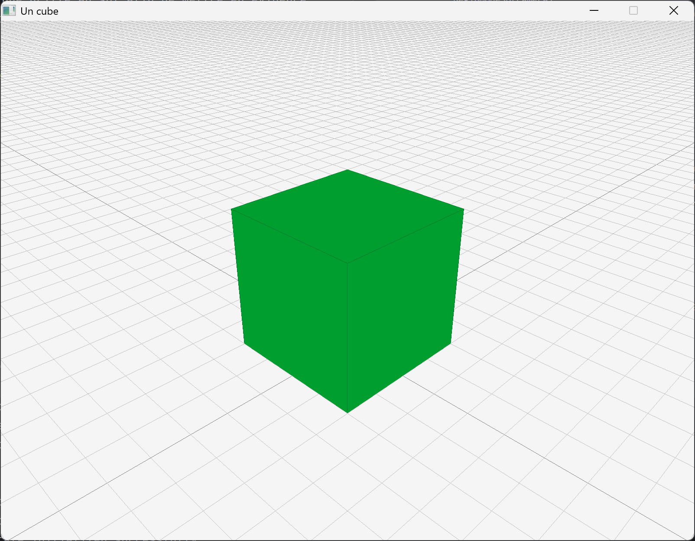

# Deuxième exemple : modularisation et dessin 3D

On va maintenant modulariser notre code. Le but ici est de séparer ce que l'on veut visualiser et le contenu de celui-ci. L'idée est d'organiser le programme selon deux grands principes (dit « [_design patterns_](https://fr.wikipedia.org/wiki/Patron_de_conception) ») :

- clairement séparer trois choses :
    - la gestion de l'application (le `main()` ou le `run()`, cf. plus loin) ;
    - le contenu à afficher ;
    - et la façon de l'afficher (dans les différentes formes : affichage à l'écran, texte, dans un fichier, ...) ;
- avoir une claire distinction entre ce qui doit être affiché, et la manière de le faire sur les différents supports, celle-ci ne devant pas intérferer avec le contenu.

> Dans ce qui suit, nous détaillons la démarche, mais il n'est pas nécessaire de tout comprendre dans le détail pour pouvoir bien réutiliser le code fourni. Néanmoins, une fois les connaissances nécessaires à la compréhension de celui-ci acquise, il peut toujours être intéressant de revenir sur les différents choix de conception.

Nous allons séparer le code sur trois grands axes (libre au lecteur d'adapter cela à ses besoins), dans trois sous-dossiers :

- `general` : qui contient tout le code « général », le coeur du projet, indépendemment de la façon dont il est visualisé ;
- `text` : qui contient la « visualisation » en mode texte, donc simplement l'affichage de messages sur le terminal ;
- `raylib` : qui contient la visualisation graphique en utilisant la bibliothèque raylib.

D'un point de vue abstrait, nous différencierons ce qui est _dessinable_ (les objets que l'on veut voir visualisés) et les _supports à dessin_ (les environnements que l'on utilise pour visualiser : ici en mode texte ou avec la bibliothèque graphique raylib ; mais on pourrait imaginer d'autres modes comme par exemple des représentations numériques (suites de nombres) dans des fichiers binaires, ou d'autres bibliothèques graphiques, etc.).

Créez un nouveau sous-dossier dans votre projet, p.ex. `DeuxiemeExemple`, et créez y les trois sous-dossiers cités ci-dessus. Vous avez alors l'architecture suivante :

```
.
├── build
├── CMakeLists.txt
├── PremierExemple
│   ├── CMakeLists.txt
│   └── main_exemple1.cpp
└── DeuxiemeExemple
    ├── general
    ├── raylib
    └── text
```

Pensez aussi à ajouter ce nouveau dossier à votre `CMakeLists.txt` principal :

```cmake
add_subdirectory(DeuxiemeExemple)
```


## Général

Dans le sous-dossier `general`, nous mettons donc tout ce qui relève de l'aspect général du projet, indépendemment de la visualisation _concrète_. On a donc en particulier ici les deux concepts (abstractions) de « dessinable » et de « support à dessin ».  
Conceptuellement, les « dessinables » sont les plus simples : il suffit d'avoir une méthode permettant de les dessiner sur un support à dessin :

```c++
// dessinable.h
#pragma once

class SupportADessin; // pré-déclaration

class Dessinable {
public:

    // la raison d'être des Dessinable
    virtual void dessine_sur(SupportADessin&) const = 0;

    // mise en virtuel du destructeur (puisque classe abstraite)
    virtual ~Dessinable()                    = default;

    // remise par défaut des constructeurs de copie et de déplacement
    Dessinable(Dessinable const&)            = default;
    Dessinable& operator=(Dessinable const&) = default;
    Dessinable(Dessinable&&)                 = default;
    Dessinable& operator=(Dessinable&&)      = default;

    // et remise aussi par défaut du constructeur par défaut
    Dessinable() = default;
};
```

Un support à dessin fournit quant à lui une méthode pour dessiner les différents contenus (pour l'instant les contenus sont flous, c'est juste pour l'exemple, mais ce sont eux qui seront les objets concrets que l'on veut dessiner) :

```c++
// support_a_dessin.h
#pragma once

// prédéclaration de tous les contenus que l'on veut dessiner
class Contenu;
// ....

class SupportADessin {
public:

    /*
     * La raison d'être des Dessinable
     *
     * Mettre ici toutes les méthodes nécessaires pour dessiner tous les
     * objets que l'on veut dessiner. Par exemple :
     */
    virtual void dessine(Contenu const& a_dessiner) = 0;
    // virtual void dessine(Nounours const& a_dessiner) = 0;
    // virtual void dessine(Voiture  const& a_dessiner) = 0;

    // mise en virtuel du destructeur (puisque classe abstraite)
    virtual ~SupportADessin() = default;

    // on ne copie pas les supports à dessin
    SupportADessin(SupportADessin const&)            = delete;
    SupportADessin& operator=(SupportADessin const&) = delete;

    // mais on peut les déplacer
    SupportADessin(SupportADessin&&)            = default;
    SupportADessin& operator=(SupportADessin&&) = default;

    // on remet aussi la version par défaut du constructeur par défaut
    SupportADessin() = default;
};
```

Maintenant, pour chaque contenu, il suffit de dériver de la classe `Dessinable` et de redéfinir la méthode `dessine_sur()` comme suit :

```c++
// contenu.h
#pragma once

#include "dessinable.h"
#include "support_a_dessin.h"

class Contenu : public Dessinable {
public:
    // à adapter suivant les besoins :
    ~Contenu()                override = default;
    Contenu(Contenu const&)            = default;
    Contenu& operator=(Contenu const&) = default;
    Contenu(Contenu&&)                 = default;
    Contenu& operator=(Contenu&&)      = default;
    Contenu()                          = default;

    /*
     * Ceci est la méthode devant être ajoutée à toute classe
     * étendant Dessinable, afin de pouvoir être dessinée correctement.
     */
    void dessine_sur(SupportADessin& support) const override
    { support.dessine(*this); }

    /*
     * Le reste de la classe peut être quelconque selon les besoins.
     */
};
```

`dessine_sur()` fait alors exactement ce que son nom indique : elle va appeler la méthode `dessine()` du support à dessin, en lui passant le contenu à dessiner, c.-à-d. elle-même.

> Le fait de devoir _copier_ cette définition de `dessine_sur()`, qui est la même pour chaque `Dessinable`, peut paraitre contre intuitif (en effet, pourquoi ne pas juste la mettre dans dessinable ?). Cela est entre autre dû au fait que cette architecture, appelée « [_double dispatch_](https://en.wikipedia.org/wiki/Double_dispatch) », est une généralisation du polymorphisme qui n'est pas totalement prévue en C++.


## Texte

Passons maintenant à l'utilisation de cette nouvelle abstraction pour visualiser notre contenu en mode texte, avec un `main()` ressemblant à cela (à mettre dans le sous-dossier `text`) :

```c++
// main_text.cpp
#include <iostream>
#include "text_viewer.h"
#include "contenu.h"

int main()
{
  TextViewer ecran(std::cout);

  Contenu c;
  c.dessine_sur(ecran);

  return 0;
}
```

Le `TextViewer` est un support à dessin qui va afficher le contenu sur un `ostream` comme p.ex. la sortie standard (`std::cout`).

```c++
// text_viewer.h
#pragma once

#include <iostream>
#include "support_a_dessin.h"

class TextViewer : public SupportADessin {
public:
    explicit TextViewer(std::ostream& flot_) : flot(flot_) {}

    ~TextViewer() override                   = default;
    TextViewer(TextViewer const&)            = delete;
    TextViewer& operator=(TextViewer const&) = delete;
    TextViewer(TextViewer&&)                 = default;
    TextViewer& operator=(TextViewer&&)      = default;

    /*
     * Il faut surcharger la méthode dessine pour dessiner le contenu.
     * Ne pas oublier de le faire pour toutes les méthodes de dessin !
     */
    void dessine(Contenu const& a_dessiner) override;

private:
    std::ostream& flot;
};
```

On peut alors implémenter la méthode `dessine()` pour afficher le contenu sur la sortie standard.

```c++
// text_viewer.cpp
#include <iostream>
#include "text_viewer.h"
#include "contenu.h"

void TextViewer::dessine(Contenu const&)
{
    flot <<
        "+------+.   " << std::endl <<
        "|`.    | `. " << std::endl <<
        "|  `+--+---+" << std::endl <<
        "|   |  |   |" << std::endl <<
        "+---+--+.  |" << std::endl <<
        " `. |    `.|" << std::endl <<
        "   `+------+" << std::endl;
    // Dessin de https://www.asciiart.eu/art-and-design/geometries
}
```

Bien entendu que dans un cas concret, nous utiliserons le contenu en paramètre afin d'afficher quelque chose de pertinent. Ici pour simplifier `Contenu` n'est qu'une coquille vide. Cela changer.

À ce stade, on a donc les fichiers suivants (dans le sous-dossier `DeuxiemeExemple`) :

```
.
├── general
│   ├── contenu.h
│   ├── dessinable.h
│   └── support_a_dessin.h
├── raylib
└── text
    ├── main_text.cpp
    ├── text_viewer.cpp
    └── text_viewer.h
```

Essayons de compiler. Il faut pour cela créer les trois `CMakeLists.txt` :

- dans le sous-dossier `DeuxiemeExemple` lui-même : simplement annoncer les trois sous-dossiers :

```cmake
add_subdirectory(general)
# add_subdirectory(raylib) # on commente pour le moment car on va commencer par le texte
add_subdirectory(text)
```

- dans le sous-dossier `DeuxiemeExemple/general` : on va créer une bibliothèque avec les fichiers `contenu.h`, `dessinable.h` et `support_a_dessin.h`, laquelle pourra être utilisée dans le reste du projet :

```cmake
# general/CMakeLists.txt

add_library(Dessin contenu.h dessinable.h support_a_dessin.h)
set_target_properties(Dessin PROPERTIES LINKER_LANGUAGE CXX)
target_include_directories(Dessin PUBLIC ${PROJECT_SOURCE_DIR}/DeuxiemeExemple/general)
```

> Quand il n'y a que des fichiers `.h`, il faut spécifier que ce sont des fichiers d'en-tête C++ grace à la propriété `LINKER_LANGUAGE CXX`, sinon on obtient une erreur (confusion avec le C). De plus, pour que d'autres fichiers puissent utiliser cette bibliothèque, il faut ajouter le dossier contenant les fichiers d'en-tête avec `target_include_directories`.

- dans le sous-dossier `DeuxiemeExemple/text` :

```cmake
# text/CMakeLists.txt

add_library(TextViewer text_viewer.h text_viewer.cpp)
target_compile_options(TextViewer PRIVATE ${PROJECT_WARNING_FLAGS})
target_link_libraries(TextViewer Dessin)

add_executable(exemple2_text main_text.cpp)
target_compile_options(exemple2_text PRIVATE ${PROJECT_WARNING_FLAGS})
target_link_libraries(exemple2_text TextViewer)
```

On a donc les fichiers suivants :

```
├── CMakeLists.txt
├── general
│   ├── CMakeLists.txt
│   ├── contenu.h
│   ├── dessinable.h
│   └── support_a_dessin.h
├── raylib
└── text
    ├── CMakeLists.txt
    ├── main_text.cpp
    ├── text_viewer.cpp
    └── text_viewer.h
```

On peut alors retourner dans le sous-dossier `build` (tout en haut) et refaire :

```sh
cmake ..
cmake --build .
```

Ce qui compile les bibliothèques que nous voulons créer, puis l'exécutable `build/bin/exemple2_text`.
Si on le lance, on a bien dans le terminal :

```
+------+.
|`.    | `.
|  `+--+---+
|   |  |   |
+---+--+.  |
 `. |    `.|
   `+------+
```

## raylib

Pour l'affichage graphique, nous procéderons un peu différemment : notre `main()` ressemblera à ceci :

```c++
// main_raylib.cpp
#include "raylib_render.h"

int main()
{
    raylibRender ecran;
    ecran.run();
    return 0;
}
```

où `raylibRender` est un `SupportADessin` dont la méthode `run()` appelle la méthode `dessine_sur()` ; et le « contenu » sera un attribut de cette classe `raylibRender` :

```c++
// raylib_render.h
#pragma once

#include "support_a_dessin.h"
#include "contenu.h"
#include <raylib.h>

class raylibRender : public SupportADessin {
public:
    raylibRender();
    ~raylibRender() override;

    void run();

    void dessine(Contenu const& a_dessiner) override;
private:
    Camera3D camera;

    Contenu c;
};
```

> Notons que le contenu pourrait être remplacé par un pointeur vers un contenu pour éviter des copies. Dans un projet plus large, ce point devra certainement être pris en considération.  
> Notez aussi la présence d'une `Camera3D`, qui est le moyen de raylib de faire des dessins en 3D. Nous reviendrons sur ce point précis dans notre prochain exemple.

Nous allons maintenant préparer les constructeurs et destructeurs afin que nous n'ayons à nous soucier uniquement de l'affichage dans la méthode `run()`.

```c++
// raylib_render.cpp

#include "raylib_render.h"

raylibRender::raylibRender()
{
    // parmétres de la fenêtre
    SetConfigFlags(FLAG_WINDOW_HIGHDPI);
    InitWindow(800, 600, "Un cube");

    // paramétres de la caméra
    camera.position = { 5.0f, 5.0f, 5.0f };
    camera.target   = { 0.0f, 1.0f, 0.0f };
    camera.up = camera.target;
    camera.fovy = 45.0f;
    camera.projection = CAMERA_PERSPECTIVE;

    SetTargetFPS(60);
}

raylibRender::~raylibRender()
{
    CloseWindow();
}
```

On notera donc que l'initialisation et la fermeture de la fenêtre sont identiques à ce que nous avions fait dans le premier exemple ; mais on rajoute ici l'initialisation des paramètres de caméra : sa position, le point qu'elle vise (`target`), le vecteur représentant la direction « haut » pour elle (`up`), son champ de vision (`fovy`) et le type de projection.

> Il est aussi possible de faire [une caméra dans le cas 2D](https://www.raylib.com/examples/core/loader.html?name=core_2d_camera), mais cela ne sera pas abordé ici.

On peut maintenant écrire la méthode `run()` afin d'avoir un affichage fonctionnel :

```c++
void raylibRender::run()
{
    while (!WindowShouldClose()) {
        BeginDrawing();
            ClearBackground(RAYWHITE);
            BeginMode3D(camera);
                // Afin de bien voir le cube, on va dessiner une grille.
                DrawGrid(200, 0.5f);

                // Et on dessine le contenu.
                c.dessine_sur(*this);
            EndMode3D();
        EndDrawing();
    }
}
```

Comme dans le premier exemple, on a notre boucle d'exécution où l'on remet un fond blanc avant de dessiner. Néanmoins, afin de dessiner nos objets, nous devons maintenant entrer dans un mode 3D avec la caméra en argument. Il ne manque plus qu'à savoir dessiner le contenu, et cela se fait par la méthode `dessine()`.

```c++
void raylibRender::dessine(Contenu const& a_dessiner)
{
    constexpr Vector3 position({ 0.0f, 1.0f, 0.0f });
    DrawCube(position, 2.0f, 2.0f, 2.0f, LIME);
    DrawCubeWires(position, 2.0f, 2.0f, 2.0f, DARKGREEN);
}
```

Comme pour le mode texte, nous avons simplifié dans cet exemple et dessiné directement un cube. Mais, bien sûr, dans un projet plus complexe ce dessin dépendra des attributs du contenu.

Le dessin d'un cube se fait en appelant la fonction `DrawCube()` avec en argument la position de celui-ci, sa largeur, sa hauteur, sa profondeur et sa couleur ([on trouvera ici d'autres exemples de figures 3D](https://www.raylib.com/examples/models/loader.html?name=models_geometric_shapes)).

> Notons que les fonctions de raylib, ayant à la base été faite en C, ne prennent pas en paramètre des `vector` de C++, mais des `Vector2` / `Vector3` de raylib, selon le nombre de composantes. Similairement, les arguments sont prévus en `float` et non en `double`, et certaines erreurs peuvent venir de là et sont donc réglables en forçant la conversion en `float`, p.ex. en ajoutant un `f` comme suffixe aux valeurs littérales.

Pour compiler nous devons :

1. supprimer le commentaire dans le `CMakeLists.txt` du sous-dossier `DeuxiemeExemple` :

```cmake
add_subdirectory(general)
add_subdirectory(raylib)
add_subdirectory(text)
```

2. créer le `CMakeLists.txt` du sous-dossier `raylib` :

```cmake
# raylib/CMakeLists.txt

add_library(RayRender raylib_render.h raylib_render.cpp)
target_compile_options(RayRender PRIVATE ${PROJECT_WARNING_FLAGS})
target_link_libraries(RayRender raylib Dessin)

add_executable(exemple2_raylib main_raylib.cpp)
target_compile_options(exemple2_raylib PRIVATE ${PROJECT_WARNING_FLAGS})
target_link_libraries(exemple2_raylib RayRender)
```

Après compilation, on devrait obtenir un affichage 3D qui ressemble à ceci :



Dans les codes ci-dessus, nous utilisons également les fonctions `DrawCubeWires()` et `DrawGrid()`, qui permettent respectivement de dessiner les contours du cube et une grille au sol afin de mettre en évidence les objets, mais ceci est superflus en soi :


> Les objets peuvent paraitre très plat, car il n'y a pas de système de lumière par défaut, ni de méthode suffisamment simple pour le présenter ici, ce qui fait qu'il n'y a pas d'ombres par exemple (l'[exemple le plus simple](https://www.raylib.com/examples/shaders/loader.html?name=shaders_basic_lighting) gère l'ombre pour chaque objet, et sinon il faudrait faire un système de « [_shadow mapping_](https://en.wikipedia.org/wiki/Shadow_mapping) »).
