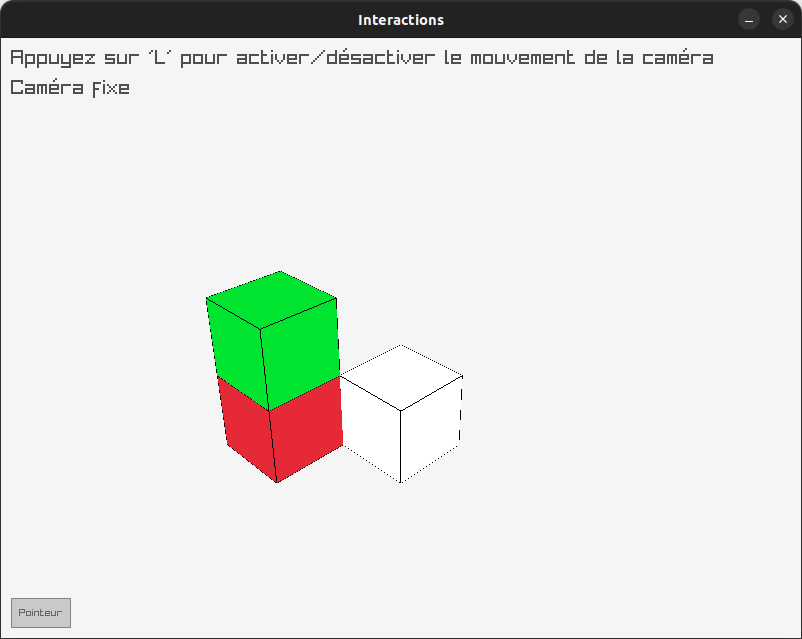
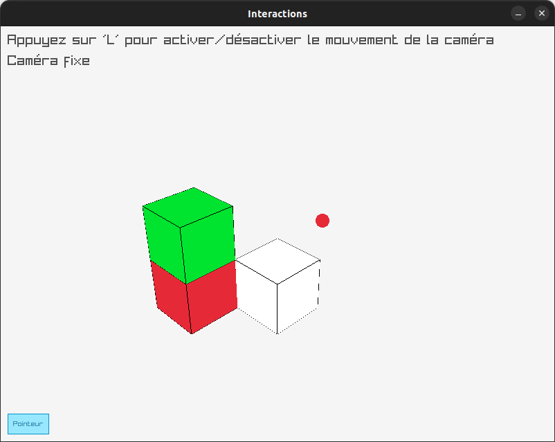

# Quatrième exemple : interactivité (souris, clavier, boutons, ...)

Dans ce quatrième exemple, nous allons voir trois interactions possibles :

- le clavier : utiliser une touche pour activer ou non le déplacement de la caméra ;
- la souris : récupérer sa position et l'utiliser pour y dessiner un objet ;
- raygui : utiliser un bouton pour activer une fonctionalité.

> Comme pour le troisième exemple, vous pouvez ici repartir de celui-ci, puis éditer les fichiers modifiés ; p.ex. sous Unix :
> ```sh
> mkdir QuatriemeExemple
> cp -r TroisiemeExemple/CMakeLists.txt TroisiemeExemple/general TroisiemeExemple/raylib QuatriemeExemple
> ```

Commençons par ajouter deux attributs à la classe `raylibRender` pour gérer l'état (actif ou non) du mouvement de la caméra et du dessin du pointeur de souris :

```c++
// ...
class raylibRender : public SupportADessin {
// ...
private:
    // ...
    bool deplacement;
    bool pointeur;
};
```

que l'on initialise par défaut dans `raylib/raylib_render.cpp` :

```c++
// ... (en-têtes)

raylibRender::raylibRender()
: liste_contenus({
      Contenu(),
      Contenu({-1,1,1}, VERT),
      Contenu({-1,0,1}, ROUGE)
  })
  , deplacement(false)
  , pointeur(false)
{
    // ... (comme avant)
}
```

Décidons d'activer le déplacement avec la touche `L`. Pour cela, on vérifie dans la boucle principale si la touche `L` est pressée, et si oui, on change l'état du déplacement. Puis on met à jour la caméra seulement si le déplacement est activé :

```c++
void raylibRender::run() {
    while (!WindowShouldClose()) {
        if (IsKeyPressed(KEY_L)) {
            deplacement = !deplacement;
        }
        if (deplacement) {
            UpdateCamera(&camera, CAMERA_FREE);
        }
        // ...
    }
}
```

Ajoutons également un message à l'écran pour indiquer si le déplacement est activé ou non.  
Pour que le texte soit correctement visible, on ne le dessine pas dans le mode 3D, mais _après_ avoir quitté ce mode 3D.  
Pour le [paramétrage du texte](https://www.raylib.com/examples/text/loader.html?name=text_format_text), on donne la chaîne de caractères à afficher, la position du texte (les deux premiers arguments numériques), la taille de la police et la couleur du texte.   
En cas d'utilisation d'une `string` C++, il faut la convertir en « chaîne à la C » via la méthode `c_str()`.

Cela donne le code suivant :

```c++
void raylibRender::run() {
            // ...
            EndMode3D();

            DrawText("Appuyez sur 'L' pour activer/désactiver le mouvement de la caméra", 10, 10, 20, DARKGRAY);
            DrawText((std::string("Caméra ") + (deplacement ? "libre" : "fixe")).c_str(), 10, 40, 20, DARKGRAY);
        EndDrawing();
    }
}
```

Et il ne faut pas oublier d'ajouter `#include <string>` dans l'entête.

> Le code ci-dessus utilise l'opérateur ternaire `?:` que vous ne connaissez peut être pas encore. Cet opérateur utilise trois argument (`A`, `B` et `C`) : `A ? B : C` et il :
> 1. évalue `A` ;
> 2. évalue `B` si `A` est vrai, et sinon évalue `C` ;
> 3. vaut le résultat de la dernière évaluation (`B` ou `C`).
     > Dans le cas ci-dessus, `(deplacement ? "libre" : "fixe")` vaut donc `"libre"` si `deplacement` est vrai et `"fixe"` sinon.

On peut essayer compiler et voir l'effet de nos modifications :

- ajoutez le nouveau dossier au `CMakeLists.txt` principal : `add_subdirectory(QuatriemeExemple)` ;
- remplacez trois fois `Dessin3` par `Dessin4` dans chacune des lignes de `QuatriemeExemple/general/CMakeLists.txt` ;
- remplacez `TroisiemeExemple` par `QuatriemeExemple` dans la dernière ligne de `QuatriemeExemple/general/CMakeLists.txt` ;
- dans `QuatriemeExemple/raylib/CMakeLists.txt` : remplacez simplement `3` par `4` ; cela :
    - remplace trois fois `RayRender3` par `RayRender4` ;
    - remplace une fois `Dessin3` par `Dessin4` ;
    - remplace deux fois `exemple3` par `exemple4`.


En lançant `bin/exemple4`, vous devriez alors obtenir :

| Mouvement OFF                            | Mouvement ON                                 |
|------------------------------------------|----------------------------------------------|
|  |  |


Voyons maintenant comment ajouter un bouton. Pour cela, nous allons utiliser la bibliothèque raygui, que l'on importe comme suit :

```c++
// raylib_render.cpp

#include "raylib_render.h"
#include <string>
#define RAYGUI_IMPLEMENTATION
#include <raygui.h>
#undef RAYGUI_IMPLEMENTATION

raylibRender::raylibRender()
// ...
```

> Dû à sa conception, il est nécessaire de mettre `#define RAYGUI_IMPLEMENTATION` avant d'inclure le fichier d'en-tête.

Sur le GitHub de [raygui](https://github.com/raysan5/raygui), nous pouvons trouver [les différents composants disponibles](https://github.com/raysan5/raygui?tab=readme-ov-file#basic-controls), ainsi que divers programmes pouvant être utile pour réfléchir à l'interface graphique, comme un [éditeur de layout](https://raylibtech.itch.io/rguilayout) ou [d'icones](https://raylibtech.itch.io/rguiicons), et des exemples d'utilisation.

Pour ce que nous allons faire, le plus adapté est un bouton ON/OFF (« _toggle_ »), que l'on peut créer comme suit :

```c++
void raylibRender::run() {
    while (!WindowShouldClose()) {
        // ...
        BeginDrawing();
            // ...
            GuiToggle(Rectangle(10, 560, 60, 30), "Pointeur", &pointeur);
        EndDrawing();
    }
}
```

Ce bouton prend en argument un rectangle (la position et la taille du bouton), le texte à afficher et un pointeur vers une variable booléenne qui va changer d'état lorsque l'on clique sur le bouton.

> Pour un bouton classique, l'utilisation est un peu différente :
> ```c++
> while (!WindowShouldClose()) {
>       // ...
>       BeginDrawing();
>           // ...
>           if (GuiButton((Rectangle){ X, Y, Longueur, Largeur }, "Texte")) {
>               // Action à réaliser
>           }
>       EndDrawing();
>   }
> ```
> Donc il ne faut pas hésiter à chercher comment s'utilise un composant avant de l'utiliser.

Pour récupérer la position de la souris, on peut utiliser la fonction `GetMousePosition()`, qui renvoie un `Vector2` avec les coordonnées de la souris. On peut alors dessiner p.ex. un cercle à cette position :

```c++
void raylibRender::run() {
    while (!WindowShouldClose()) {
        // ...
        BeginDrawing();
            // ...
            GuiToggle(Rectangle(10, 560, 60, 30), "Pointeur", &pointeur);
            if (pointeur) {
                auto [x, y] = GetMousePosition();
                DrawCircle(static_cast<int>(x), static_cast<int>(y), 10.0f, RED);
            }
        EndDrawing();
    }
}
```


Pour compiler, comme raygui est un fichier d'en-tête, il faut inclure son dossier dans les endroits où chercher. On utilise pour cela la commande `target_include_directories`. Par contre, il **ne** faut par ailleurs **pas** utiliser ici les options de compilation `${PROJECT_WARNING_FLAGS}` qui génèreront bien trop de warnings en raison du C de raygui :

```cmake
# QuatriemeExemple/raylib/CMakeLists.txt

add_library(RayRender4 raylib_render.h raylib_render.cpp)
target_include_directories(RayRender4 PRIVATE ${raygui_SOURCE_DIR}/src)
target_link_libraries(RayRender4 raylib Dessin4)

add_executable(exemple4 main_raylib.cpp)
target_compile_options(exemple4 PRIVATE ${PROJECT_WARNING_FLAGS})
target_link_libraries(exemple4 RayRender4)
```

Compilez, en ignorant les « _warnings_ » propres à `raygui.h` (petite différence de norme entre C et C++).

> Vous pouvez aussi supprimer ces warnings en demandant au compilateur de les ignorer en ajoutant l'option `-Wno-enum-compare` :
> ```cmake 
> target_compile_options(RayRender4 PRIVATE ${PROJECT_WARNING_FLAGS} -Wno-enum-compare)
> ``` 


L'exécutable devrait alors donner un affichage comme suit :

| Pointeur OFF                           | Pointeur ON                             |
|----------------------------------------|-----------------------------------------|
|  |  |

> Il est aussi possible de faire [un bouton sans utiliser raygui](https://www.raylib.com/examples/textures/loader.html?name=textures_sprite_button), mais cela est sensiblement plus complexe.
