# Configuration d'éditeurs de code

Ci-après une brève présentation d'un processus de configuration et d'utilisation de CMake avec différents éditeurs de code. Cela présuppose que [CMake](https://cmake.org/) et [Ninja](https://cmake.org/) sont installés, et que ce sont les compilateurs [GCC](https://gcc.gnu.org/) qui sont utilisés (sinon, il faudra adapter certaines étapes).

## Visual Studio Code

On aura tout d'abord besoin de l'extension `CMake Tools` afin d'avoir une bonne intégration de CMake dans Visual Studio Code.

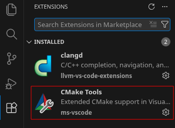

Une fois l'extension installée, on peut ouvrir un projet CMake. Il sera alors demandé de sélectionner un kit de compilation, et on choisira celui correspondant à notre configuration.

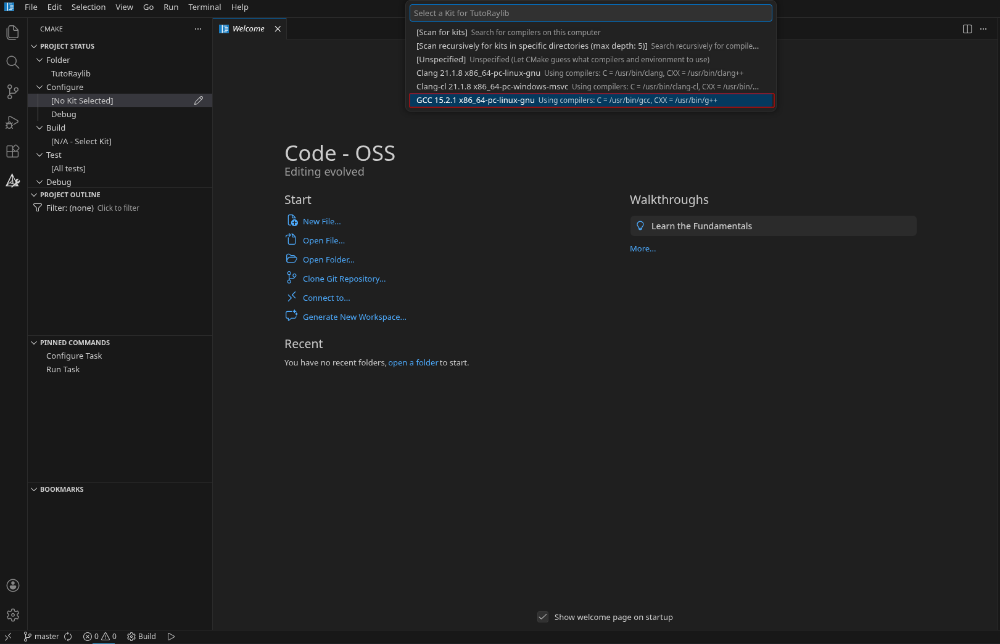

Après la selection du kit, si tout se passe bien, CMake devrait avoir généré les fichiers de build pour notre projet.

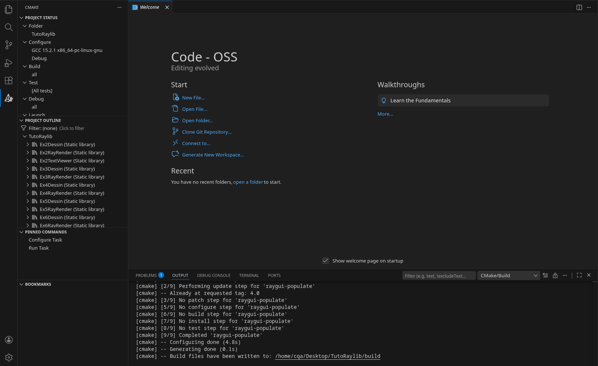

On peut alors ouvrir la palette de commande (`Ctrl+Shift+P`) et chercher `CMake: Build` pour lancer la compilation du projet.

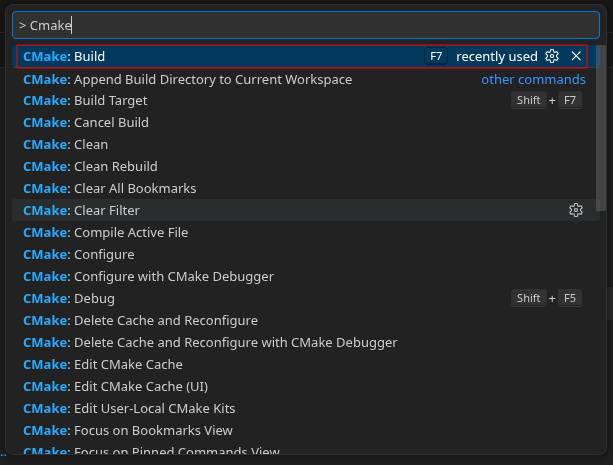

L'exécutable se sélectionne de la même manière, en cherchant `CMake: Set Launch/Debug Target` dans la palette de commande.

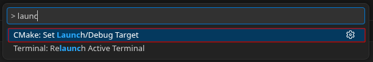

Une fois tout configuré, on peut alors utiliser les boutons de build et de lancement dans la barre en bas à gauche de l'interface pour compiler et exécuter le programme.

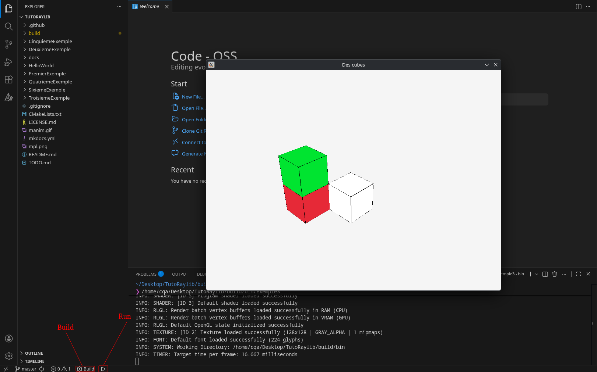

## Geany

Pour Geany, il peut être plus pratique d'installer le plugin `Project Organizer` pour avoir accès à des fonctionnalités de gestion de projet tel qu'un arbre de fichiers.

| Ouvrir le gestionnaire de plugin                    | Gestionnaire de plugin                                      |
|-----------------------------------------------------|-------------------------------------------------------------|
| 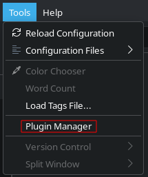 | 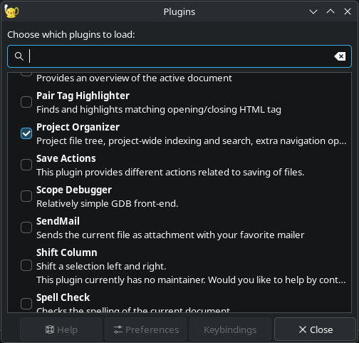 |

En ouvrant un projet utilisant CMake, il faut commencer par créer un dossier de `build` à la racine du projet, puis configurer les commandes de build et d'exécution dans les préférences de Geany, ou directement dans le fichier de projet (`.geany`) comme suit :

```text
...

[build-menu]
NF_00_LB=_CMake
NF_00_CM=cmake ..
NF_00_WD=%p/build
NF_01_LB=
NF_01_CM=
NF_01_WD=
NF_02_LB=_Build
NF_02_CM=cmake  --build .
NF_02_WD=%p/build
EX_00_LB=_Execute
EX_00_CM=./exemple1
EX_00_WD=%p/build/bin
```

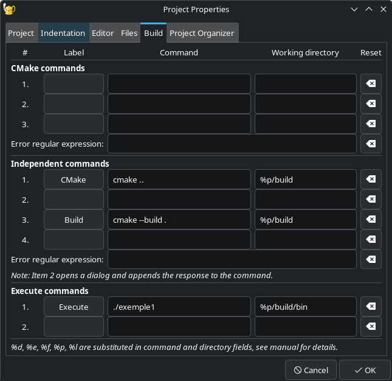

En remplaçant `exemple1` par le nom de l'exécutable généré par CMake. La configuration de build `CMake` sert alors à générer les fichiers de build dans le dossier `build`, tandis que la configuration `Build` compile le projet, et la configuration `Execute` lance l'exécutable sélectionné.

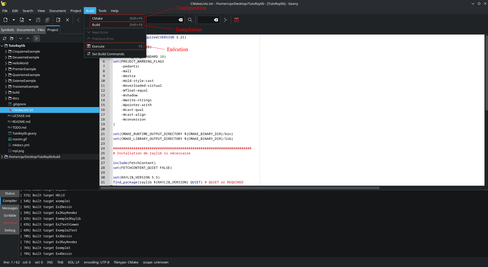

## Qt Creator

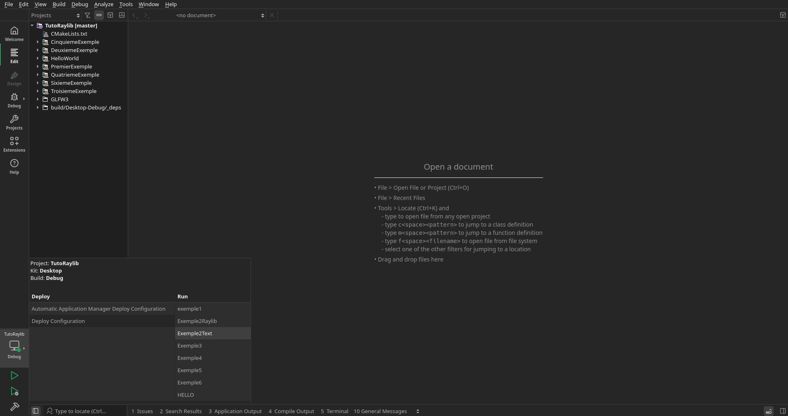

## CLion

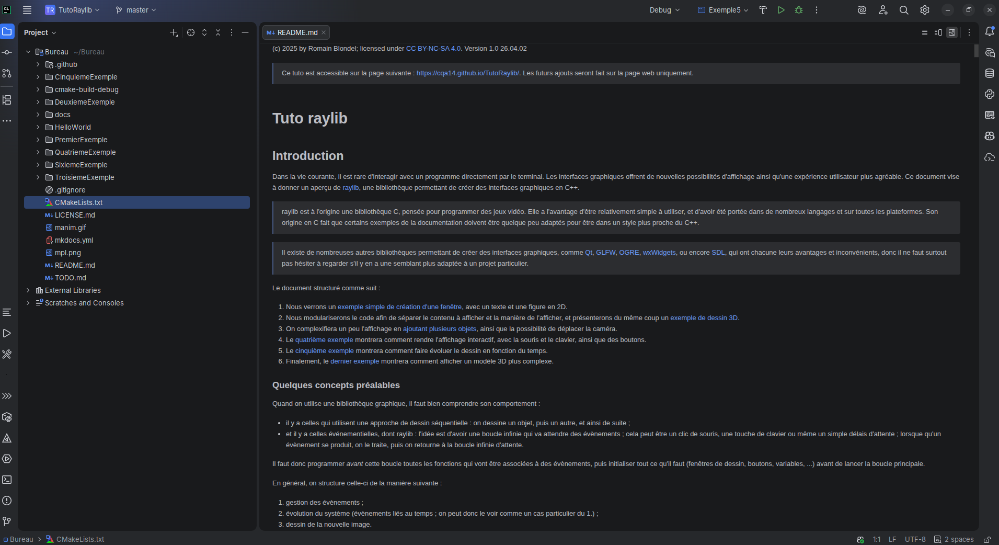
